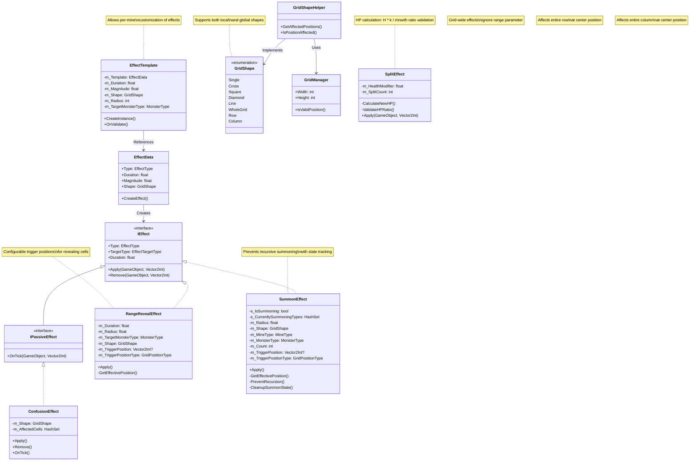
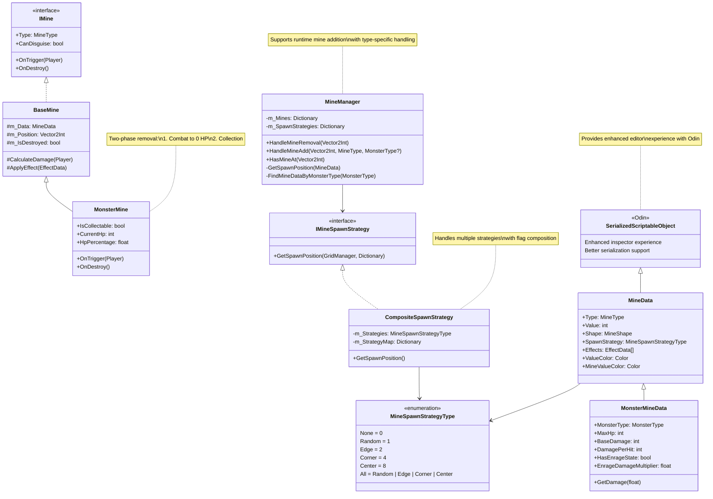
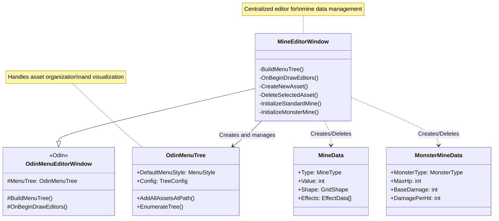

### Effect System

```mermaid
classDiagram
class IEffect {
<<interface>>
+Type: EffectType
+TargetType: EffectTargetType
+Duration: float
+Apply(GameObject, Vector2Int)
+Remove(GameObject, Vector2Int)
}
class IPassiveEffect {
<<interface>>
+OnTick(GameObject, Vector2Int)
}
class EffectTemplate {
-m_Template: EffectData
-m_Duration: float
-m_Magnitude: float
-m_Shape: GridShape
-m_Radius: int
-m_TargetMonsterType: MonsterType
+CreateInstance()
+OnValidate()
}
class EffectData {
+Type: EffectType
+Duration: float
+Magnitude: float
+Shape: GridShape
+CreateEffect()
}
class GridShape {
<<enumeration>>
Single
Cross
Square
Diamond
Line
WholeGrid
Row
Column
}
class GridShapeHelper {
+GetAffectedPositions()
+IsPositionAffected()
}
class GridManager {
+Width: int
+Height: int
+IsValidPosition()
}
class RangeRevealEffect {
-m_Duration: float
-m_Radius: float
-m_TargetMonsterType: MonsterType
-m_Shape: GridShape
-m_TriggerPosition: Vector2Int?
-m_TriggerPositionType: GridPositionType
+Apply()
-GetEffectivePosition()
}
class SummonEffect {
-s_IsSummoning: bool
-s_CurrentlySummoningTypes: HashSet
-m_Radius: float
-m_Shape: GridShape
-m_MineType: MineType
-m_MonsterType: MonsterType
-m_Count: int
-m_TriggerPosition: Vector2Int?
-m_TriggerPositionType: GridPositionType
+Apply()
-GetEffectivePosition()
-PreventRecursion()
-CleanupSummonState()
}
class ConfusionEffect {
-m_Shape: GridShape
-m_AffectedCells: HashSet
+Apply()
+Remove()
+OnTick()
}
class SplitEffect {
-m_HealthModifier: float
-m_SplitCount: int
-CalculateNewHP()
-ValidateHPRatio()
+Apply(GameObject, Vector2Int)
}
IEffect <|-- IPassiveEffect
IPassiveEffect <|.. ConfusionEffect
IEffect <|.. RangeRevealEffect
IEffect <|.. SummonEffect
EffectTemplate --> EffectData : References
EffectData --> IEffect : Creates
GridShapeHelper --> GridManager : Uses
GridShapeHelper --> GridShape : Implements
note for EffectTemplate "Allows per-mine\ncustomization of effects"
note for RangeRevealEffect "Configurable trigger positions\nfor revealing cells"
note for SummonEffect "Prevents recursive summoning\nwith state tracking"
note for SplitEffect "HP calculation: H * k / n\nwith ratio validation"
note for GridShape "Supports both local\nand global shapes"
note for WholeGrid "Grid-wide effects\nignore range parameter"
note for Row "Affects entire row\nat center position"
note for Column "Affects entire column\nat center position"
```

### Mine System

```mermaid
classDiagram
class IMine {
<<interface>>
+Type: MineType
+CanDisguise: bool
+OnTrigger(Player)
+OnDestroy()
}
class BaseMine {
#m_Data: MineData
#m_Position: Vector2Int
#m_IsDestroyed: bool
#CalculateDamage(Player)
#ApplyEffect(EffectData)
}
class MonsterMine {
+IsCollectable: bool
+CurrentHp: int
+HpPercentage: float
+OnTrigger(Player)
+OnDestroy()
}
class IMineSpawnStrategy {
<<interface>>
+GetSpawnPosition(GridManager, Dictionary)
}
class CompositeSpawnStrategy {
-m_Strategies: MineSpawnStrategyType
-m_StrategyMap: Dictionary
+GetSpawnPosition()
}
class MineSpawnStrategyType {
<<enumeration>>
None = 0
Random = 1
Edge = 2
Corner = 4
Center = 8
All = Random | Edge | Corner | Center
}
class MineData {
+Type: MineType
+Value: int
+Shape: MineShape
+SpawnStrategy: MineSpawnStrategyType
+Effects: EffectData[]
+ValueColor: Color
+MineValueColor: Color
}
class MonsterMineData {
+MonsterType: MonsterType
+MaxHp: int
+BaseDamage: int
+DamagePerHit: int
+HasEnrageState: bool
+EnrageDamageMultiplier: float
+GetDamage(float)
}
class SerializedScriptableObject {
<<Odin>>
Enhanced inspector experience
Better serialization support
}
class MineManager {
-m_Mines: Dictionary
-m_SpawnStrategies: Dictionary
+HandleMineRemoval(Vector2Int)
+HandleMineAdd(Vector2Int, MineType, MonsterType?)
+HasMineAt(Vector2Int)
-GetSpawnPosition(MineData)
-FindMineDataByMonsterType(MonsterType)
}
IMine <|.. BaseMine
BaseMine <|-- MonsterMine
IMineSpawnStrategy <|.. CompositeSpawnStrategy
MineManager --> IMineSpawnStrategy
MineData --> MineSpawnStrategyType
CompositeSpawnStrategy --> MineSpawnStrategyType
SerializedScriptableObject <|-- MineData
MineData <|-- MonsterMineData
note for MonsterMine "Two-phase removal:\n1. Combat to 0 HP\n2. Collection"
note for MineManager "Supports runtime mine addition\nwith type-specific handling"
note for CompositeSpawnStrategy "Handles multiple strategies\nwith flag composition"
note for SerializedScriptableObject "Provides enhanced editor\nexperience with Odin"
```

### Editor Tools

```mermaid
classDiagram
class MineEditorWindow {
    -BuildMenuTree()
    -OnBeginDrawEditors()
    -CreateNewAsset<T>()
    -DeleteSelectedAsset()
    -InitializeStandardMine()
    -InitializeMonsterMine()
}
class OdinMenuEditorWindow {
    <<Odin>>
    #MenuTree: OdinMenuTree
    #BuildMenuTree()
    #OnBeginDrawEditors()
}
class OdinMenuTree {
    +DefaultMenuStyle: MenuStyle
    +Config: TreeConfig
    +AddAllAssetsAtPath()
    +EnumerateTree()
}
class MineData {
    +Type: MineType
    +Value: int
    +Shape: GridShape
    +Effects: EffectData[]
}
class MonsterMineData {
    +MonsterType: MonsterType
    +MaxHp: int
    +BaseDamage: int
    +DamagePerHit: int
}
MineEditorWindow --|> OdinMenuEditorWindow
MineEditorWindow --> OdinMenuTree : Creates and manages
MineEditorWindow ..> MineData : Creates/Deletes
MineEditorWindow ..> MonsterMineData : Creates/Deletes
note for MineEditorWindow "Centralized editor for\nmine data management"
note for OdinMenuTree "Handles asset organization\nand visualization"
```