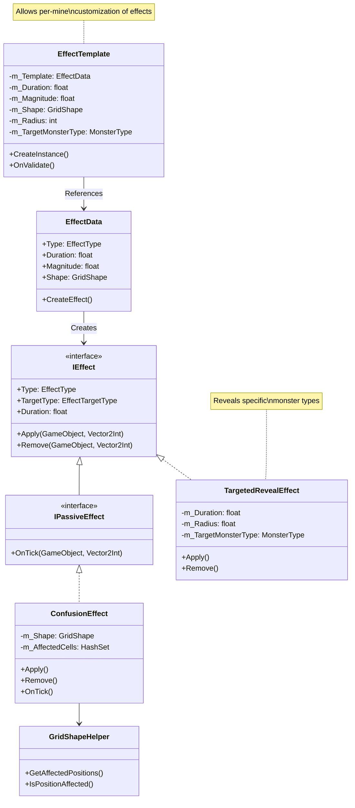

### Effect System

```mermaid
classDiagram
class IEffect {
<<interface>>
+Type: EffectType
+TargetType: EffectTargetType
+Duration: float
+Apply(GameObject, Vector2Int)
+Remove(GameObject, Vector2Int)
}
class IPassiveEffect {
<<interface>>
+OnTick(GameObject, Vector2Int)
}
class EffectTemplate {
-m_Template: EffectData
-m_Duration: float
-m_Magnitude: float
-m_Shape: GridShape
-m_Radius: int
-m_TargetMonsterType: MonsterType
+CreateInstance()
+OnValidate()
}
class EffectData {
+Type: EffectType
+Duration: float
+Magnitude: float
+Shape: GridShape
+CreateEffect()
}
class TargetedRevealEffect {
-m_Duration: float
-m_Radius: float
-m_TargetMonsterType: MonsterType
+Apply()
+Remove()
}
class ConfusionEffect {
-m_Shape: GridShape
-m_AffectedCells: HashSet
+Apply()
+Remove()
+OnTick()
}
class GridShapeHelper {
+GetAffectedPositions()
+IsPositionAffected()
}
IEffect <|-- IPassiveEffect
IPassiveEffect <|.. ConfusionEffect
IEffect <|.. TargetedRevealEffect
ConfusionEffect --> GridShapeHelper
EffectTemplate --> EffectData : References
EffectData --> IEffect : Creates
note for EffectTemplate "Allows per-mine\ncustomization of effects"
note for TargetedRevealEffect "Reveals specific\nmonster types"
``` 