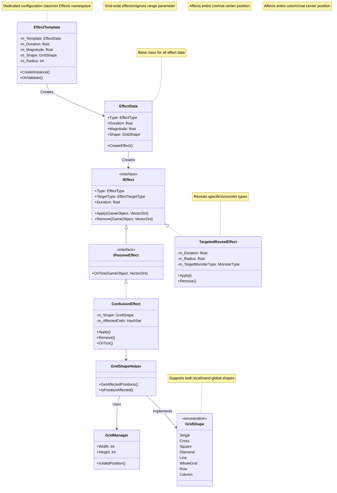
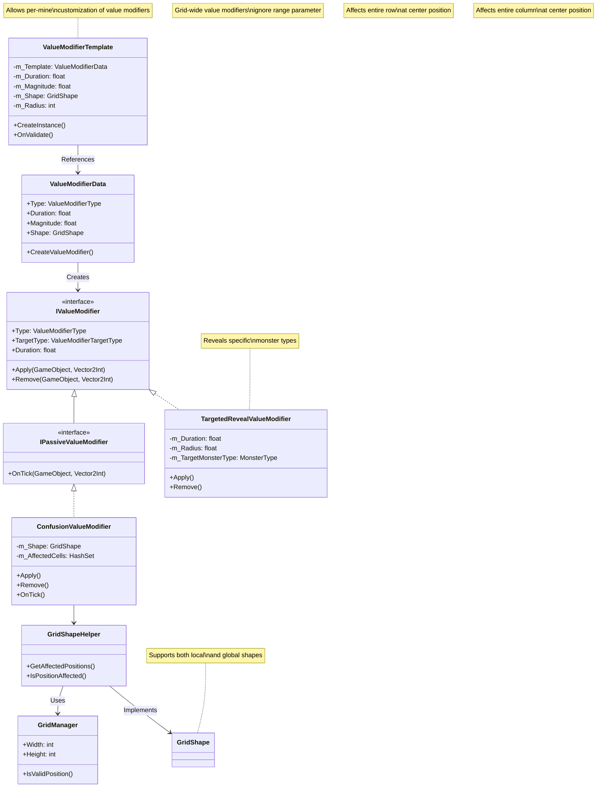

### Effect System

```mermaid
classDiagram
class IEffect {
<<interface>>
+Type: EffectType
+TargetType: EffectTargetType
+Duration: float
+Apply(GameObject, Vector2Int)
+Remove(GameObject, Vector2Int)
}
class IPassiveEffect {
<<interface>>
+OnTick(GameObject, Vector2Int)
}
class EffectTemplate {
-m_Template: EffectData
-m_Duration: float
-m_Magnitude: float
-m_Shape: GridShape
-m_Radius: int
+CreateInstance()
+OnValidate()
}
class EffectData {
+Type: EffectType
+Duration: float
+Magnitude: float
+Shape: GridShape
+CreateEffect()
}
class GridShape {
<<enumeration>>
Single
Cross
Square
Diamond
Line
WholeGrid
Row
Column
}
class GridShapeHelper {
+GetAffectedPositions()
+IsPositionAffected()
}
class GridManager {
+Width: int
+Height: int
+IsValidPosition()
}
class TargetedRevealEffect {
-m_Duration: float
-m_Radius: float
-m_TargetMonsterType: MonsterType
+Apply()
+Remove()
}
class ConfusionEffect {
-m_Shape: GridShape
-m_AffectedCells: HashSet
+Apply()
+Remove()
+OnTick()
}
IEffect <|-- IPassiveEffect
IPassiveEffect <|.. ConfusionEffect
IEffect <|.. TargetedRevealEffect
ConfusionEffect --> GridShapeHelper
EffectTemplate --> EffectData : Creates
EffectData --> IEffect : Creates
GridShapeHelper --> GridManager : Uses
GridShapeHelper --> GridShape : Implements
note for EffectTemplate "Dedicated configuration class\nin Effects namespace"
note for EffectData "Base class for all effect data"
note for TargetedRevealEffect "Reveals specific\nmonster types"
note for GridShape "Supports both local\nand global shapes"
note for WholeGrid "Grid-wide effects\nignore range parameter"
note for Row "Affects entire row\nat center position"
note for Column "Affects entire column\nat center position"
```

### Value Modification System

```mermaid
classDiagram
class IValueModifier {
<<interface>>
+Type: ValueModifierType
+TargetType: ValueModifierTargetType
+Duration: float
+Apply(GameObject, Vector2Int)
+Remove(GameObject, Vector2Int)
}
class IPassiveValueModifier {
<<interface>>
+OnTick(GameObject, Vector2Int)
}
class ValueModifierTemplate {
-m_Template: ValueModifierData
-m_Duration: float
-m_Magnitude: float
-m_Shape: GridShape
-m_Radius: int
+CreateInstance()
+OnValidate()
}
class ValueModifierData {
+Type: ValueModifierType
+Duration: float
+Magnitude: float
+Shape: GridShape
+CreateValueModifier()
}
class GridShapeHelper {
+GetAffectedPositions()
+IsPositionAffected()
}
class GridManager {
+Width: int
+Height: int
+IsValidPosition()
}
class TargetedRevealValueModifier {
-m_Duration: float
-m_Radius: float
-m_TargetMonsterType: MonsterType
+Apply()
+Remove()
}
class ConfusionValueModifier {
-m_Shape: GridShape
-m_AffectedCells: HashSet
+Apply()
+Remove()
+OnTick()
}
IValueModifier <|-- IPassiveValueModifier
IPassiveValueModifier <|.. ConfusionValueModifier
IValueModifier <|.. TargetedRevealValueModifier
ConfusionValueModifier --> GridShapeHelper
ValueModifierTemplate --> ValueModifierData : References
ValueModifierData --> IValueModifier : Creates
GridShapeHelper --> GridManager : Uses
GridShapeHelper --> GridShape : Implements
note for ValueModifierTemplate "Allows per-mine\ncustomization of value modifiers"
note for TargetedRevealValueModifier "Reveals specific\nmonster types"
note for GridShape "Supports both local\nand global shapes"
note for WholeGrid "Grid-wide value modifiers\nignore range parameter"
note for Row "Affects entire row\nat center position"
note for Column "Affects entire column\nat center position"
``` 