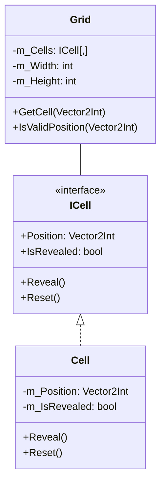
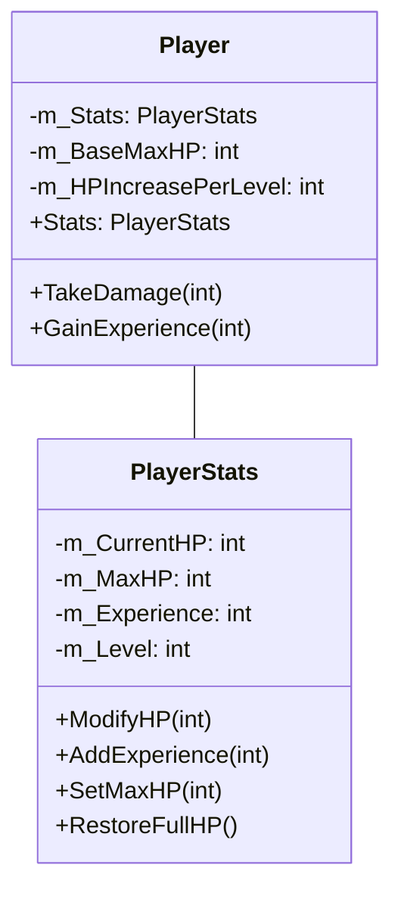
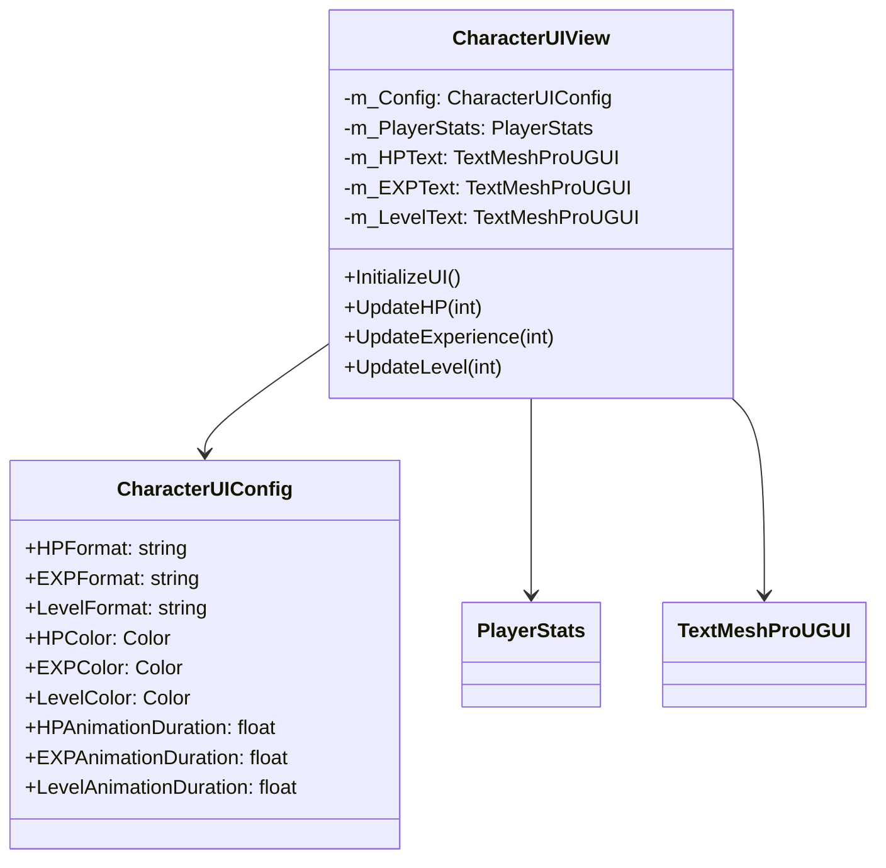
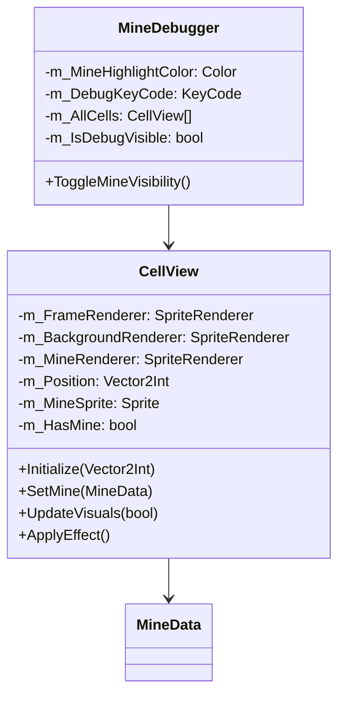
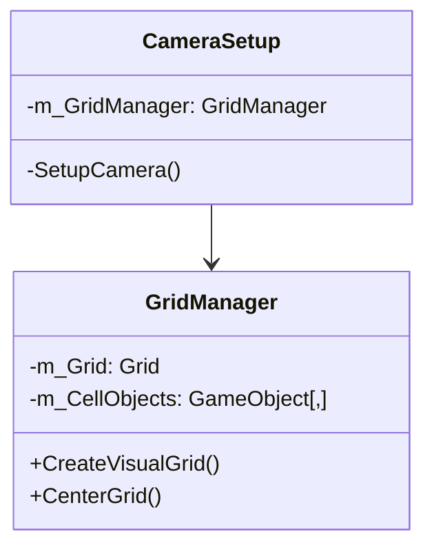
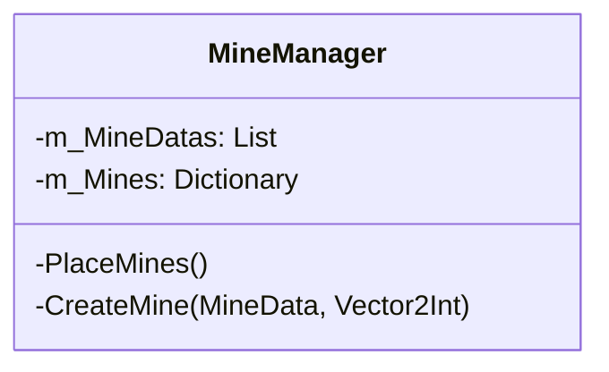

# RPG Minesweeper Architecture

## Core Systems

### Grid System



### Mine System
```mermaid
classDiagram
class IMine {
<<interface>>
+Type: MineType
+CanDisguise: bool
+OnTrigger(Player)
+OnDestroy()
}
class BaseMine {
#m_Data: MineData
#m_Position: Vector2Int
#m_IsDestroyed: bool
#CalculateDamage(Player)
#ApplyEffect(EffectData)
}
class MineData {
+Type: MineType
+Damage: int
+TriggerRadius: float
+Effects: List~EffectData~
-m_MineSprite: Sprite
+MineSprite: Sprite
}
class HealingMine {
+OnTrigger(Player)
#ApplyEffect(EffectData)
}
class ExperienceMine {
+CanDisguise: bool
+OnTrigger(Player)
}
class MultiTriggerMine {
-m_TriggerCount: int
-m_RequiredTriggers: int
+OnTrigger(Player)
}
class AreaRevealMine {
+OnTrigger(Player)
-RevealArea()
}
IMine <|.. BaseMine
BaseMine <|-- HealingMine
BaseMine <|-- ExperienceMine
BaseMine <|-- MultiTriggerMine
BaseMine <|-- AreaRevealMine
BaseMine --> MineData

classDiagram
class MineManager {
    -m_MineDatas: List<MineData>
    -m_Mines: Dictionary<Vector2Int, IMine>
    +CalculateCellValue(Vector2Int): int
    +HasMine(Vector2Int): bool
    -PlaceMines()
    -CreateMine(MineData, Vector2Int)
}
class CellView {
    -m_ValueText: TextMeshPro
    -m_MineManager: MineManager
    +UpdateVisuals(bool)
    -DisplayValue(int)
}
CellView --> MineManager
MineManager --> IMine
```

### Player System


### UI System


### Event System
mermaid
classDiagram
class GameEvents {
<<static>>
+OnCellRevealed: Action<Vector2Int>
+OnMineTriggered: Action<MineType>
+OnEffectApplied: Action<Vector2Int>
+OnExperienceGained: Action<int>
}
```

### Visualization System


## Managers

### Grid Management


### Mine Management
