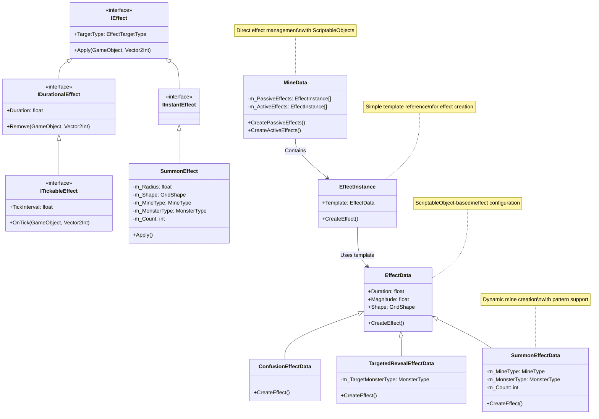

# RPG Minesweeper Architecture

## Core Systems

### Grid System


### Mine System


### Player System
```mermaid
classDiagram
class Player {
    -m_Stats: PlayerStats
    -m_BaseMaxHP: int
    -m_HPIncreasePerLevel: int
    -m_CurrentShield: int
    +TakeDamage(int)
    +GainExperience(int)
    +AddShield(int)
    +RemoveShield(int)
}
class PlayerStats {
    -m_CurrentHP: int
    -m_MaxHP: int
    -m_Experience: int
    -m_Level: int
    +ModifyHP(int)
    +AddExperience(int)
    +SetMaxHP(int)
    +RestoreFullHP()
}
class GameEvents {
    +OnShieldChanged: Action~int~
    +RaiseShieldChanged(int)
}
Player -- PlayerStats
Player --> GameEvents : Notifies shield changes

### Event System
```mermaid
classDiagram
class GameEvents {
<<static>>
+OnCellRevealed: Action<Vector2Int>
+OnMineTriggered: Action<MineType>
+OnEffectApplied: Action<Vector2Int>
+OnExperienceGained: Action<int>
+OnMineRemovalAttempted: Action<Vector2Int>
}
```

### Visualization System


## Managers

### Grid Management


### Mine Management


### Effect System


### Value Modification System
