# v0.1.35 - 2025-02-17 23:28:25
## Overview
Refactored the effect system to use more descriptive interface names and standardized parameter types, improving code clarity and maintainability.

## Change Details
### Architecture Improvements
#### Effect System Refactoring
- Renamed interfaces to better reflect their purposes:
  - `IActiveEffect` → `ITriggerableEffect`
  - `IPassiveEffect` → `IPersistentEffect`
- Standardized radius parameters to use float type
- Enhanced parameter type consistency across effects
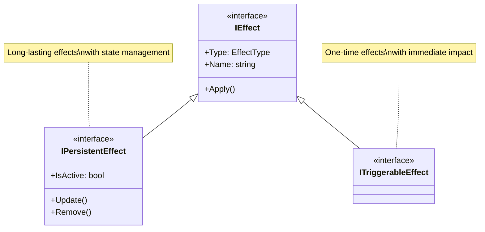
```mermaid
classDiagram
class IEffect {
    <<interface>>
    +Type: EffectType
    +Name: string
    +Apply()
}
class IPersistentEffect {
    <<interface>>
    +IsActive: bool
    +Update()
    +Remove()
}
class ITriggerableEffect {
    <<interface>>
}
IEffect <|-- IPersistentEffect
IEffect <|-- ITriggerableEffect
note for IPersistentEffect "Long-lasting effects\nwith state management"
note for ITriggerableEffect "One-time effects\nwith immediate impact"
```

### Adjustments and Refactoring
#### Effect Implementation
- Updated all effect classes to use new interfaces
- Fixed type mismatches in parameter handling
- Improved cleanup of effect states
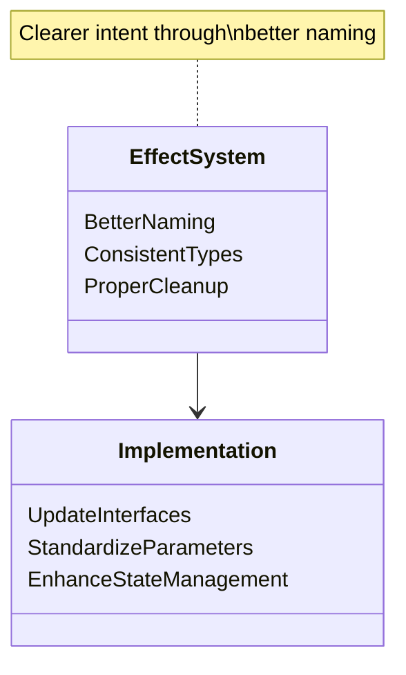
```mermaid
classDiagram
class EffectSystem {
    BetterNaming
    ConsistentTypes
    ProperCleanup
}
class Implementation {
    UpdateInterfaces
    StandardizeParameters
    EnhanceStateManagement
}
EffectSystem --> Implementation
note for EffectSystem "Clearer intent through\nbetter naming"
```

### Optimizations
- Improved type safety in effect system
- Enhanced parameter consistency
- Better state management
- Clearer code organization

# v0.1.34 - 2025-02-17 14:30:00
## Overview
Added new freeze and unfreeze effects system with round-based duration tracking, enhancing tactical gameplay with temporary cell disablement mechanics.

## Change Details
### New Features
#### Freeze Effect System
- Implemented FreezeEffect with configurable duration and area of effect
- Added UnfreezeEffect for removing frozen state from cells
- Enhanced CellView with frozen state management and visual feedback
- Added round advancement system for testing duration-based effects

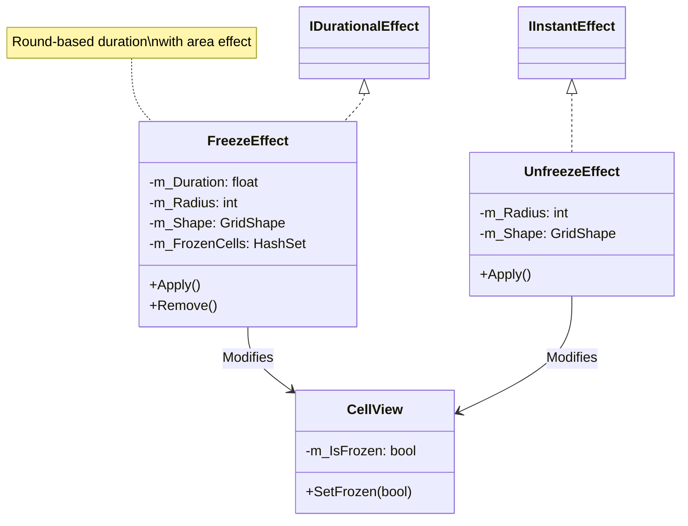
```mermaid
classDiagram
class FreezeEffect {
-m_Duration: float
-m_Radius: int
-m_Shape: GridShape
-m_FrozenCells: HashSet
+Apply()
+Remove()
}
class UnfreezeEffect {
-m_Radius: int
-m_Shape: GridShape
+Apply()
}
class CellView {
-m_IsFrozen: bool
+SetFrozen(bool)
}
IDurationalEffect <|.. FreezeEffect
IInstantEffect <|.. UnfreezeEffect
FreezeEffect --> CellView : Modifies
UnfreezeEffect --> CellView : Modifies
note for FreezeEffect "Round-based duration\nwith area effect"
```

### Adjustments and Refactoring
#### Round System Implementation
- Added round advancement system in MineDebugger
- Implemented round tracking with GameEvents
- Enhanced effect system with round-based duration support
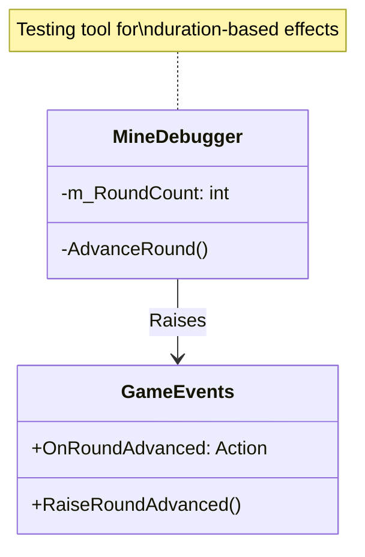
```mermaid
classDiagram
class GameEvents {
+OnRoundAdvanced: Action
+RaiseRoundAdvanced()
}
class MineDebugger {
-m_RoundCount: int
-AdvanceRound()
}
MineDebugger --> GameEvents : Raises
note for MineDebugger "Testing tool for\nduration-based effects"
```

### Optimizations
- Improved frozen state visualization with proper tint
- Enhanced effect area calculation efficiency
- Optimized cell state management


# v0.1.33 - 2025-02-17 13:59:00
## Overview
Fixed infinite recursion issue in SummonEffect when used as a passive effect, improving stability and preventing stack overflow errors.

## Change Details
### Bug Fixes
#### Summon Effect System
- Fixed infinite recursion when monster mines use summon as passive effect
- Added static tracking of active summon operations
- Implemented monster type tracking to prevent recursive summoning
- Enhanced error handling with proper cleanup

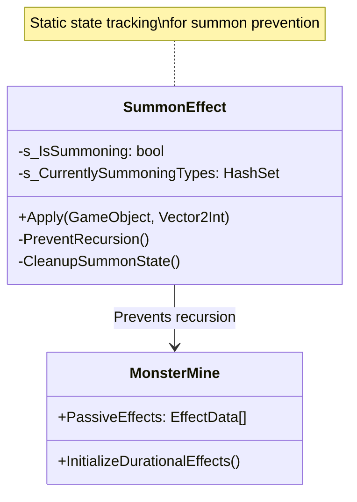
```mermaid
classDiagram
class SummonEffect {
    -s_IsSummoning: bool
    -s_CurrentlySummoningTypes: HashSet
    +Apply(GameObject, Vector2Int)
    -PreventRecursion()
    -CleanupSummonState()
}
class MonsterMine {
    +PassiveEffects: EffectData[]
    +InitializeDurationalEffects()
}
SummonEffect --> MonsterMine : Prevents recursion
note for SummonEffect "Static state tracking\nfor summon prevention"
```

### Adjustments and Refactoring
#### Effect State Management
- Implemented proper state tracking for summon operations
- Added cleanup in finally block for consistent state
- Enhanced error handling with warning logs

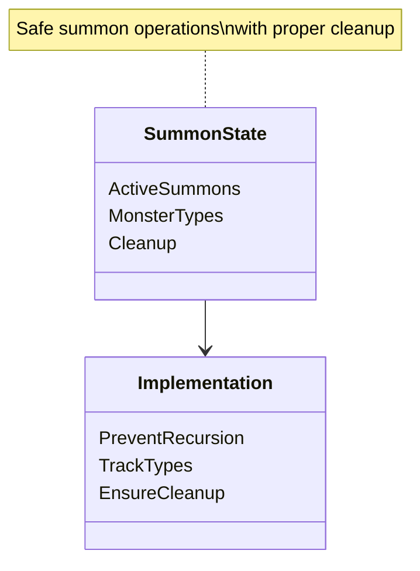
```mermaid
classDiagram
class SummonState {
    ActiveSummons
    MonsterTypes
    Cleanup
}
class Implementation {
    PreventRecursion
    TrackTypes
    EnsureCleanup
}
SummonState --> Implementation
note for SummonState "Safe summon operations\nwith proper cleanup"
```

### Optimizations
- Improved summon effect stability
- Enhanced error handling and logging
- Optimized state management for summon operations

# v0.1.32 - 2025-02-17 04:30:00
## Overview
Enhanced split effect system with improved HP calculations and trigger conditions, ensuring more balanced and intuitive monster splitting mechanics.

## Change Details
### Bug Fixes
#### Split Effect System
- Fixed split effect triggering on death instead of hit
- Corrected HP calculation formula for split monsters
- Added proper HP ratio validation
- Ensured correct current HP setting

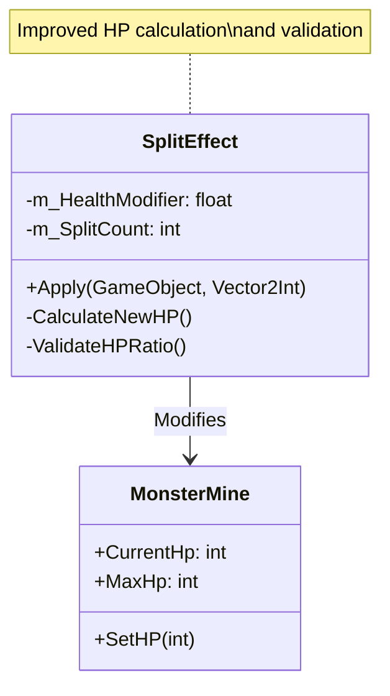
```mermaid
classDiagram
class SplitEffect {
-m_HealthModifier: float
-m_SplitCount: int
+Apply(GameObject, Vector2Int)
-CalculateNewHP()
-ValidateHPRatio()
}
class MonsterMine {
+CurrentHp: int
+MaxHp: int
+SetHP(int)
}
SplitEffect --> MonsterMine : Modifies
note for SplitEffect "Improved HP calculation\nand validation"
```

### Adjustments and Refactoring
#### HP Management System
- Implemented H * k / n formula for HP calculation
- Added HP ratio validation to prevent invalid splits
- Enhanced HP setting for consistent state

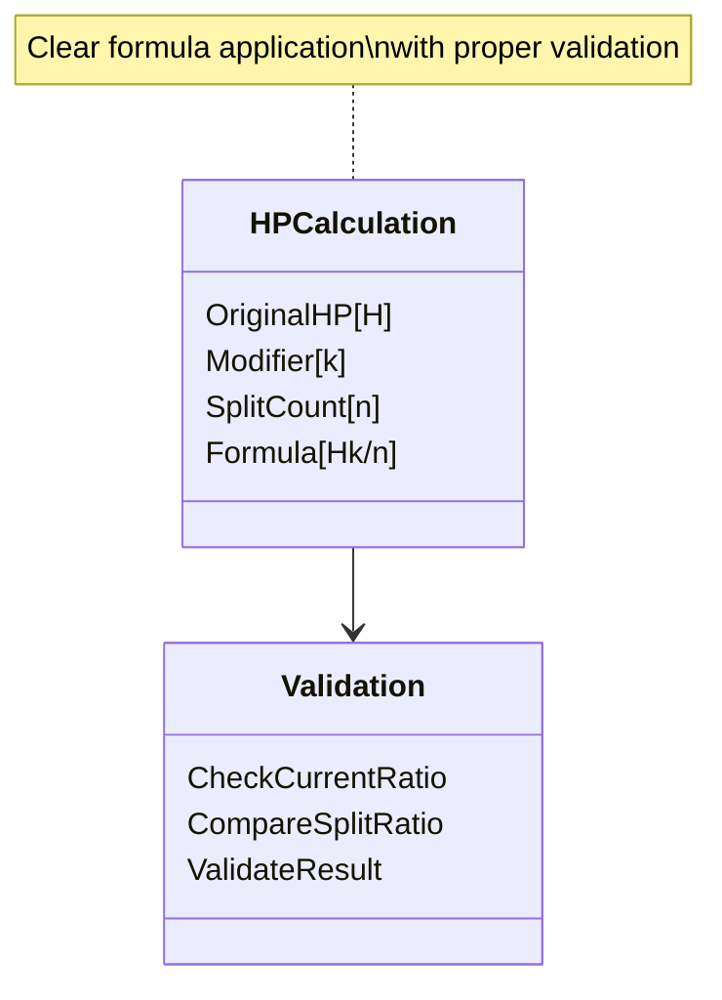
```mermaid
classDiagram
class HPCalculation {
OriginalHP[H]
Modifier[k]
SplitCount[n]
Formula[Hk/n]
}
class Validation {
CheckCurrentRatio
CompareSplitRatio
ValidateResult
}
HPCalculation --> Validation
note for HPCalculation "Clear formula application\nwith proper validation"
```

### Optimizations
- Improved HP calculation accuracy
- Enhanced split condition validation
- Optimized HP state management

# v0.1.31 - 2025-02-17 04:00:00
## Overview
Enhanced SummonEffect system with standardized position handling using GridPositionType, improving flexibility and consistency in mine placement mechanics.

## Change Details
### Architecture Improvements
#### SummonEffect Enhancement
- Updated SummonEffect to use GridPositionType for position selection
- Added configurable trigger positions to SummonEffectData
- Standardized position handling across effect types
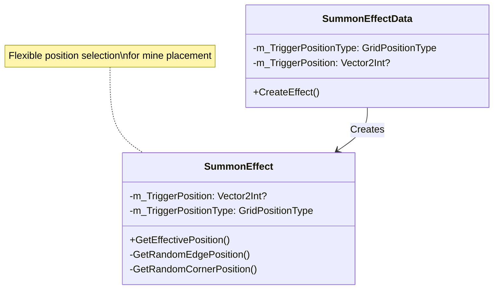
```mermaid
classDiagram
class SummonEffect {
    -m_TriggerPosition: Vector2Int?
    -m_TriggerPositionType: GridPositionType
    +GetEffectivePosition()
    -GetRandomEdgePosition()
    -GetRandomCornerPosition()
}
class SummonEffectData {
    -m_TriggerPositionType: GridPositionType
    -m_TriggerPosition: Vector2Int?
    +CreateEffect()
}
SummonEffectData --> SummonEffect : Creates
note for SummonEffect "Flexible position selection\nfor mine placement"
```

### Adjustments and Refactoring
#### Position Selection System
- Reused position helper methods from RangeRevealEffect
- Enhanced position calculation with standardized approach
- Improved code reusability across effect types
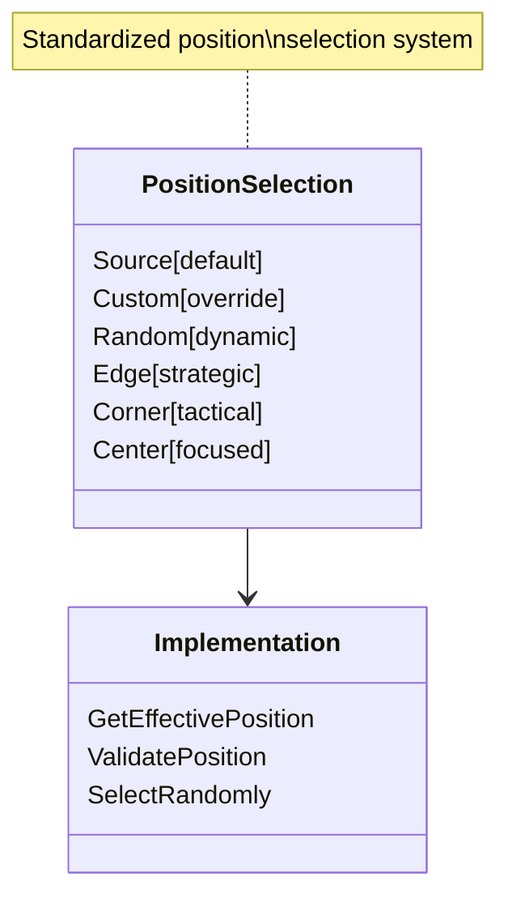
```mermaid
classDiagram
class PositionSelection {
    Source[default]
    Custom[override]
    Random[dynamic]
    Edge[strategic]
    Corner[tactical]
    Center[focused]
}
class Implementation {
    GetEffectivePosition
    ValidatePosition
    SelectRandomly
}
PositionSelection --> Implementation
note for PositionSelection "Standardized position\nselection system"
```

### Optimizations
- Reduced code duplication in position calculations
- Improved position selection flexibility
- Enhanced mine placement strategy options

# v0.1.30 - 2025-02-17 03:45:00
## Overview
Enhanced grid position system with standardized position types and improved RangeRevealEffect with configurable trigger positions.

## Change Details
### Architecture Improvements
#### Grid Position System
- Introduced GridPositionType enum for standardized position handling
- Deprecated MineSpawnStrategyType in favor of GridPositionType
- Enhanced position calculation with helper methods
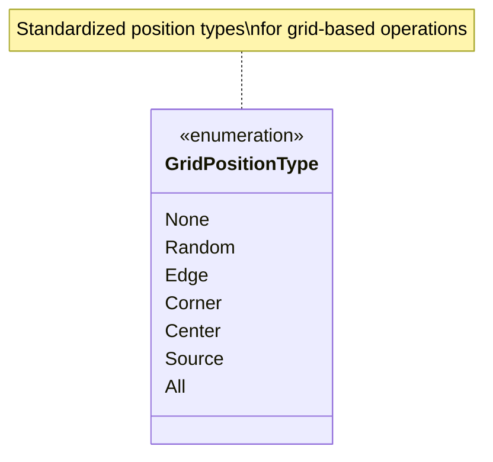
```mermaid
classDiagram
class GridPositionType {
    <<enumeration>>
    None
    Random
    Edge
    Corner
    Center
    Source
    All
}
note for GridPositionType "Standardized position types\nfor grid-based operations"
```

### Adjustments and Refactoring
#### RangeRevealEffect Enhancement
- Added configurable trigger positions
- Implemented position type-based targeting
- Enhanced position calculation system
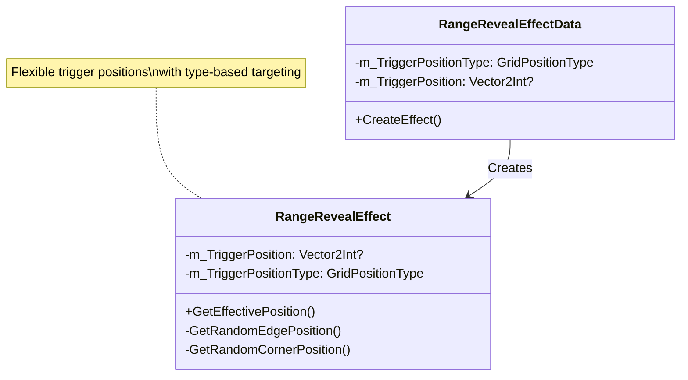
```mermaid
classDiagram
class RangeRevealEffect {
    -m_TriggerPosition: Vector2Int?
    -m_TriggerPositionType: GridPositionType
    +GetEffectivePosition()
    -GetRandomEdgePosition()
    -GetRandomCornerPosition()
}
class RangeRevealEffectData {
    -m_TriggerPositionType: GridPositionType
    -m_TriggerPosition: Vector2Int?
    +CreateEffect()
}
RangeRevealEffectData --> RangeRevealEffect : Creates
note for RangeRevealEffect "Flexible trigger positions\nwith type-based targeting"
```

### Optimizations
- Improved position calculation reusability
- Enhanced effect trigger flexibility
- Standardized position type handling

# v0.1.29 - 2025-02-17 03:15:00
## Overview
Added a new summon effect system for dynamic mine creation and fixed monster data configuration issues.

## Change Details
### New Features
#### Summon Effect System
- Implemented SummonEffect for dynamic mine placement
- Added ScriptableObject-based configuration with SummonEffectData
- Enhanced pattern-based summoning with shape and radius support
- Added support for both standard and monster mine types
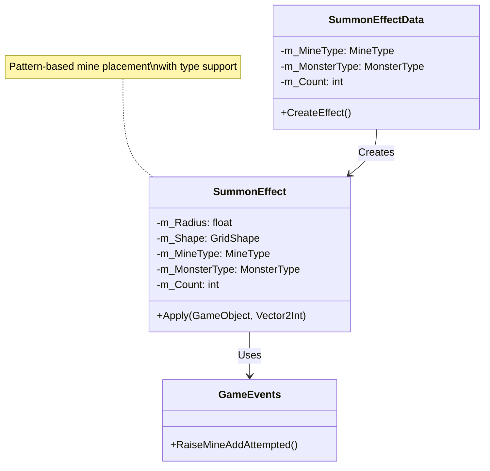
```mermaid
classDiagram
class SummonEffect {
    -m_Radius: float
    -m_Shape: GridShape
    -m_MineType: MineType
    -m_MonsterType: MonsterType
    -m_Count: int
    +Apply(GameObject, Vector2Int)
}
class SummonEffectData {
    -m_MineType: MineType
    -m_MonsterType: MonsterType
    -m_Count: int
    +CreateEffect()
}
class GameEvents {
    +RaiseMineAddAttempted()
}
SummonEffectData --> SummonEffect : Creates
SummonEffect --> GameEvents : Uses
note for SummonEffect "Pattern-based mine placement\nwith type support"
```

### Bug Fixes
#### Monster Data Configuration
- Fixed Rat monster data configuration
- Corrected MineType and MonsterType settings
- Adjusted stats for better gameplay balance
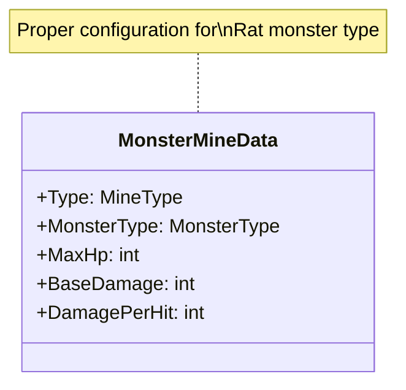
```mermaid
classDiagram
class MonsterMineData {
    +Type: MineType
    +MonsterType: MonsterType
    +MaxHp: int
    +BaseDamage: int
    +DamagePerHit: int
}
note for MonsterMineData "Proper configuration for\nRat monster type"
```

### Optimizations
- Improved mine placement validation
- Enhanced position selection for summon effects
- Optimized value recalculation after mine placement

# v0.1.28 - 2025-02-17 02:31:30
## Overview
Simplified the effect system by removing the property override mechanism, leveraging ScriptableObject's natural template functionality instead of using a complex reflection-based system.

## Change Details
### Architecture Improvements
#### Effect System Simplification
- Removed reflection-based property override system
- Simplified EffectInstance to use direct template reference
- Enhanced code maintainability through reduced complexity
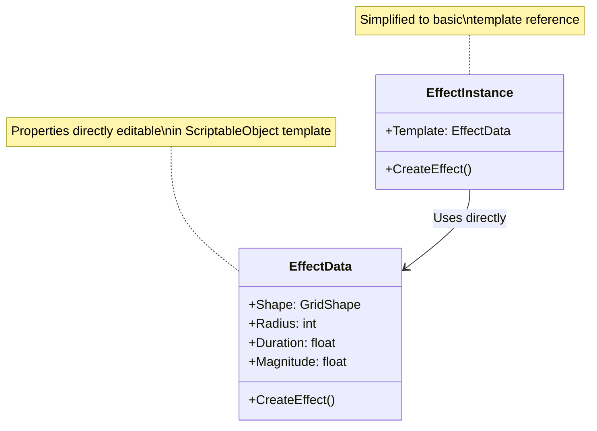
```mermaid
classDiagram
class EffectInstance {
    +Template: EffectData
    +CreateEffect()
}
class EffectData {
    +Shape: GridShape
    +Radius: int
    +Duration: float
    +Magnitude: float
    +CreateEffect()
}
EffectInstance --> EffectData : Uses directly
note for EffectData "Properties directly editable\nin ScriptableObject template"
note for EffectInstance "Simplified to basic\ntemplate reference"
```

### Adjustments and Refactoring
#### Code Cleanup
- Removed OverridablePropertyAttribute
- Removed SerializableDictionary implementation
- Simplified property declarations in effect data classes
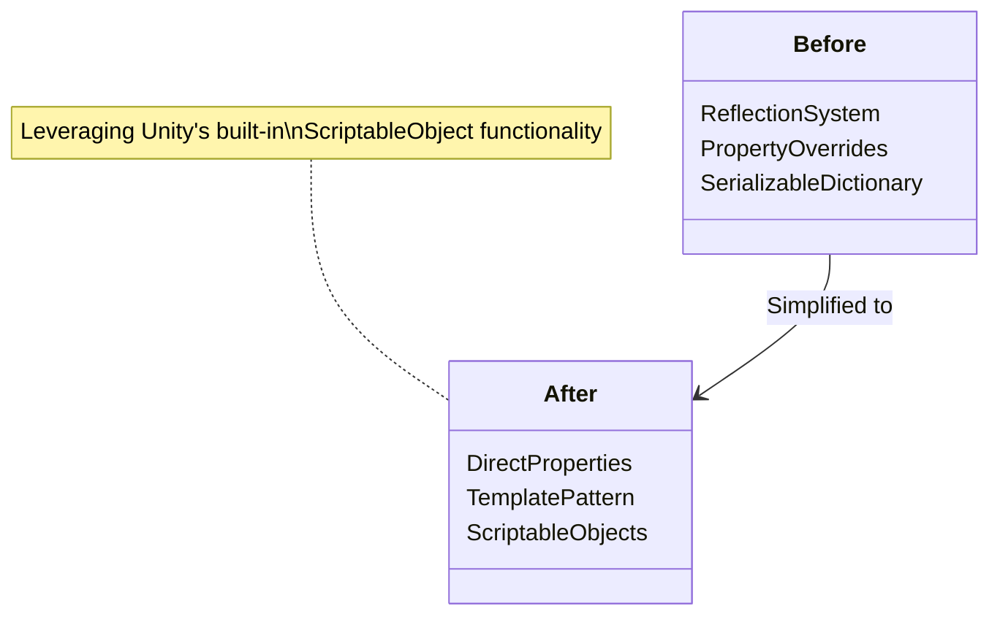
```mermaid
classDiagram
class Before {
    ReflectionSystem
    PropertyOverrides
    SerializableDictionary
}
class After {
    DirectProperties
    TemplatePattern
    ScriptableObjects
}
Before --> After : Simplified to
note for After "Leveraging Unity's built-in\nScriptableObject functionality"
```

### Optimizations
- Reduced runtime overhead by removing reflection
- Improved memory usage by eliminating override tracking
- Enhanced inspector performance
- Simplified effect instance creation

# v0.1.27 - 2025-02-17 02:20:51
## Overview
Enhanced the effect system with dynamic property overrides using reflection, enabling automatic discovery and customization of effect properties while maintaining performance through caching.

## Change Details
### Architecture Improvements
#### Dynamic Effect Property System
- Implemented reflection-based property discovery with caching
- Added OverridablePropertyAttribute for marking customizable properties
- Created SerializableDictionary for Unity-compatible override storage
- Enhanced inspector UI with dynamic property overrides

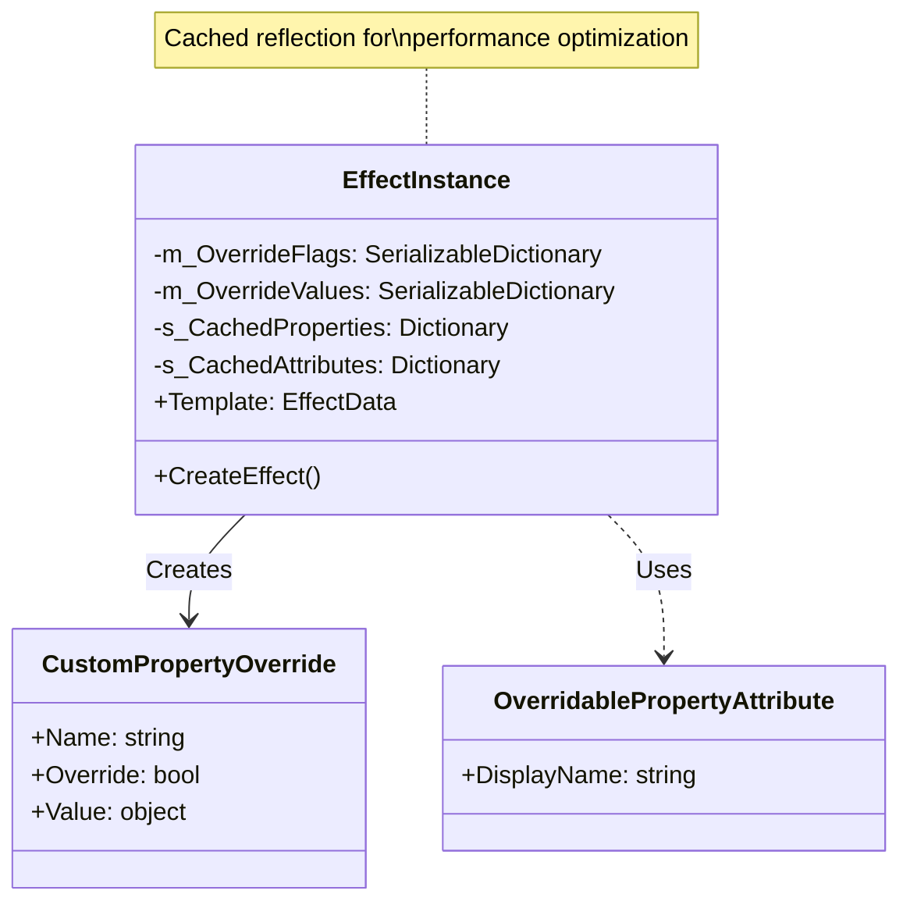
```mermaid
classDiagram
class EffectInstance {
-m_OverrideFlags: SerializableDictionary
-m_OverrideValues: SerializableDictionary
-s_CachedProperties: Dictionary
-s_CachedAttributes: Dictionary
+Template: EffectData
+CreateEffect()
}
class OverridablePropertyAttribute {
+DisplayName: string
}
class CustomPropertyOverride {
+Name: string
+Override: bool
+Value: object
}
EffectInstance --> CustomPropertyOverride : Creates
EffectInstance ..> OverridablePropertyAttribute : Uses
note for EffectInstance "Cached reflection for\nperformance optimization"
```

### Adjustments and Refactoring
#### Property Override Management
- Implemented caching system for reflection operations
- Enhanced property discovery with attribute system
- Improved serialization support for Unity

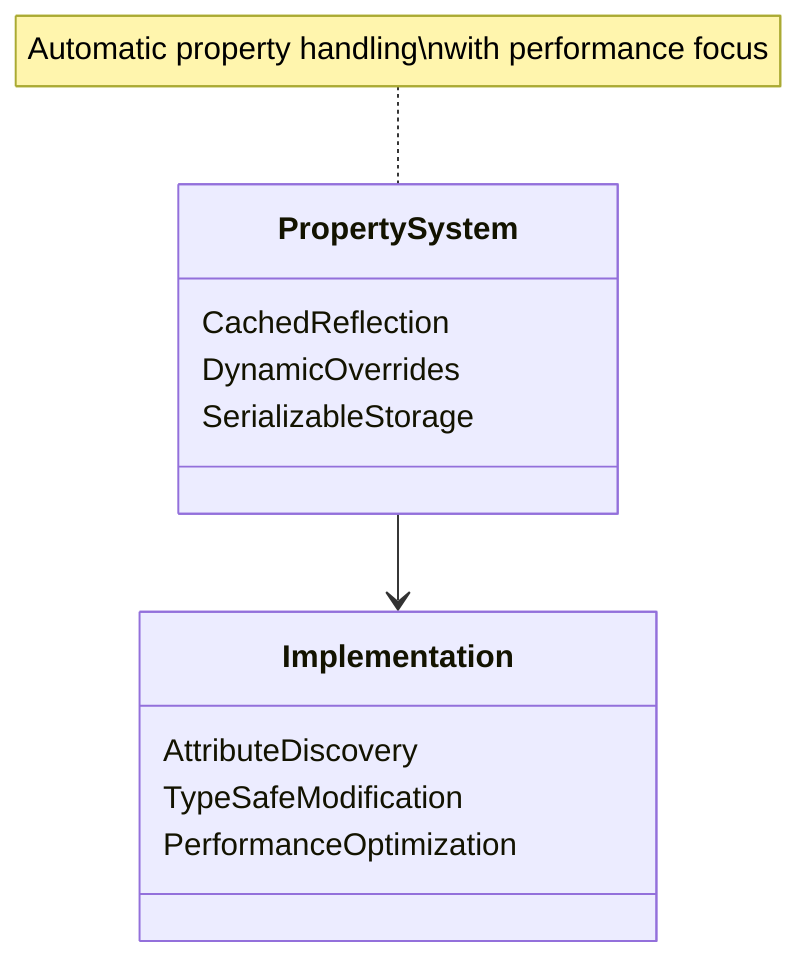
```mermaid
classDiagram
class PropertySystem {
CachedReflection
DynamicOverrides
SerializableStorage
}
class Implementation {
AttributeDiscovery
TypeSafeModification
PerformanceOptimization
}
PropertySystem --> Implementation
note for PropertySystem "Automatic property handling\nwith performance focus"
```

### Optimizations
- Cached reflection results for better performance
- Optimized property discovery through static caching
- Enhanced memory usage with proper cleanup
- Improved inspector responsiveness


# v0.1.26 - 2025-02-17 01:43:51
## Overview
Simplified the effect system by removing the EffectTemplate wrapper and implementing direct ScriptableObject editing with Odin Inspector, improving maintainability and usability.

## Change Details
### Architecture Improvements
#### Effect System Simplification
- Removed EffectTemplate intermediary layer
- Implemented direct EffectData editing
- Added automatic effect instance management
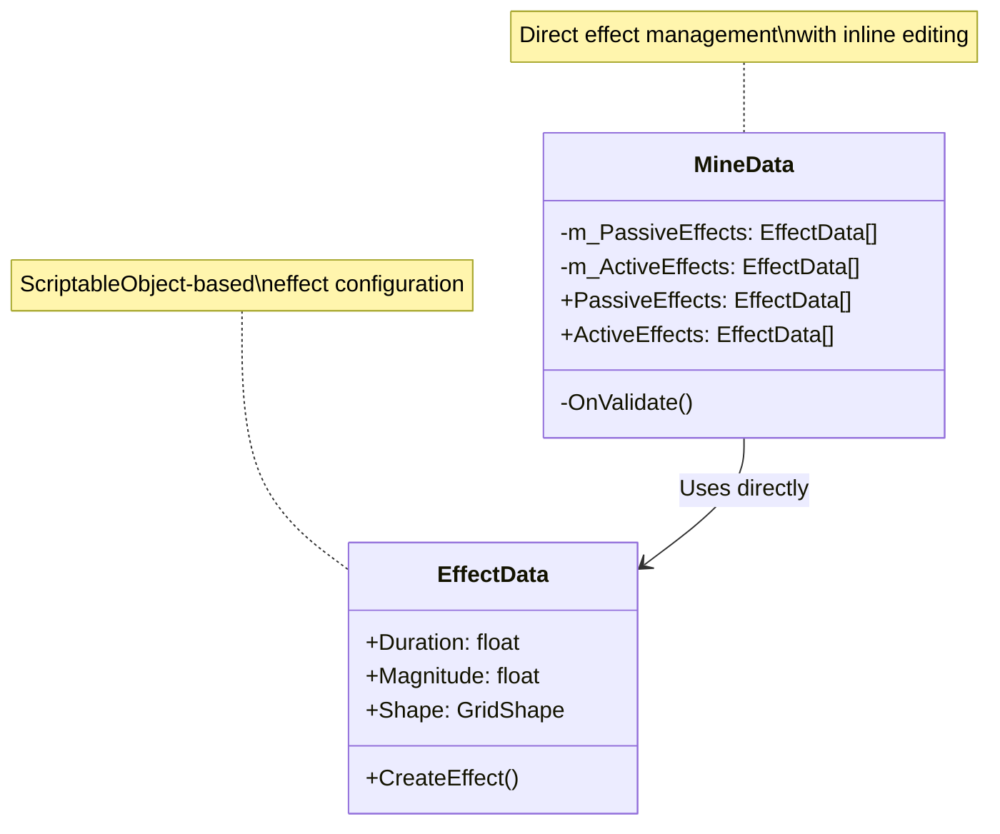
```mermaid
classDiagram
class MineData {
    -m_PassiveEffects: EffectData[]
    -m_ActiveEffects: EffectData[]
    +PassiveEffects: EffectData[]
    +ActiveEffects: EffectData[]
    -OnValidate()
}
class EffectData {
    +Duration: float
    +Magnitude: float
    +Shape: GridShape
    +CreateEffect()
}
MineData --> EffectData : Uses directly
note for MineData "Direct effect management\nwith inline editing"
note for EffectData "ScriptableObject-based\neffect configuration"
```

### Adjustments and Refactoring
#### Inspector Enhancement
- Added inline effect property editing
- Improved effect organization with tabs
- Enhanced visual feedback and grouping
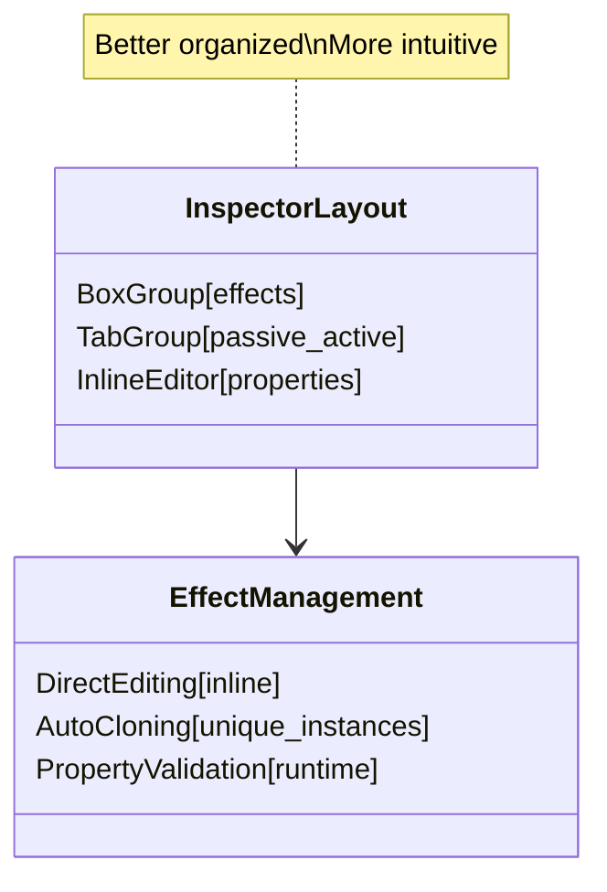
```mermaid
classDiagram
class InspectorLayout {
    BoxGroup[effects]
    TabGroup[passive_active]
    InlineEditor[properties]
}
class EffectManagement {
    DirectEditing[inline]
    AutoCloning[unique_instances]
    PropertyValidation[runtime]
}
InspectorLayout --> EffectManagement
note for InspectorLayout "Better organized\nMore intuitive"
```

### Optimizations
- Reduced code complexity by removing wrapper layer
- Improved effect instance management
- Enhanced inspector usability
- Simplified effect property access

# v0.1.25 - 2025-02-17 01:15:00
## Overview
Refactored the effect system to better follow Interface Segregation Principle, removing the EffectType enum and introducing specialized interfaces for different effect behaviors.

## Change Details
### Architecture Improvements
#### Effect System Redesign
- Removed EffectType enum in favor of concrete classes
- Split IEffect into specialized interfaces
- Enhanced effect property organization
- Improved namespace consistency
```mermaid
classDiagram
class IEffect {
    <<interface>>
    +TargetType: EffectTargetType
    +Apply()
}
class IDurationalEffect {
    <<interface>>
    +Duration: float
    +Remove()
}
class IInstantEffect {
    <<interface>>
}
class ITickableEffect {
    <<interface>>
    +TickInterval: float
    +OnTick()
}
IEffect <|-- IDurationalEffect
IEffect <|-- IInstantEffect
IDurationalEffect <|-- ITickableEffect
note for IEffect "Base interface with\nminimal requirements"
note for ITickableEffect "For effects needing\nperiodic updates"
```

### Adjustments and Refactoring
#### Effect Implementation
- Updated effect classes to use appropriate interfaces
- Improved property organization in EffectData
- Enhanced type safety with pattern matching
```mermaid
classDiagram
class ConfusionEffect {
    +Apply()
    +Remove()
    +OnTick()
}
class RangeRevealEffect {
    +Apply()
}
class TargetedRevealEffect {
    +Apply()
}
ITickableEffect <|.. ConfusionEffect
IInstantEffect <|.. RangeRevealEffect
IInstantEffect <|.. TargetedRevealEffect
note for ConfusionEffect "Uses tickable interface\nfor periodic updates"
note for RangeRevealEffect "Simple instant effect\nno cleanup needed"
```

### Optimizations
- Reduced coupling by removing enum dependency
- Improved effect type safety
- Enhanced code organization and maintainability
- Simplified effect property management

# v0.1.24 - 2025-02-16 23:47:15
## Overview
Added a custom editor window for managing mine data assets, enhancing the development workflow with a centralized interface for creating and managing both standard and monster mines.

## Change Details
### New Features
#### Mine Editor Window
- Implemented custom editor window using Odin Inspector
- Added asset creation and management functionality
- Enhanced organization with categorized mine types
```mermaid
classDiagram
class MineEditorWindow {
    +BuildMenuTree()
    +OnBeginDrawEditors()
    -CreateNewAsset<T>()
    -DeleteSelectedAsset()
    -InitializeStandardMine()
    -InitializeMonsterMine()
}
class OdinMenuTree {
    +AddAllAssetsAtPath()
    +EnumerateTree()
    +Config: TreeConfig
}
class ScriptableObject {
    <<Unity>>
    +CreateInstance<T>()
}
MineEditorWindow --|> OdinMenuEditorWindow
MineEditorWindow --> OdinMenuTree : Creates
MineEditorWindow --> ScriptableObject : Manages
note for MineEditorWindow "Centralized interface for\nmine data management"
```

### Architecture Improvements
#### Asset Management System
- Implemented proper asset initialization with default values
- Added drag-and-drop support for mine assets
- Enhanced asset deletion with confirmation dialog
```mermaid
classDiagram
class AssetManagement {
    CreateAsset
    InitializeValues
    DeleteAsset
}
class Workflow {
    DragAndDrop
    Confirmation
    KeyboardShortcuts
}
AssetManagement --> Workflow
note for AssetManagement "Streamlined asset\nmanagement workflow"
```

### Optimizations
- Improved asset creation workflow
- Enhanced error handling and validation
- Optimized folder structure management

# v0.1.23 - 2025-02-16 23:13:00
## Overview
Enhanced the mine data system with Odin Inspector integration, improving editor workflow and data management through better visualization and organization.

## Change Details
### Architecture Improvements
#### Mine Data System Enhancement
- Converted mine data classes to use SerializedScriptableObject
- Implemented proper grouping and layout with Odin attributes
- Added validation attributes for numeric fields
- Enhanced visual feedback with preview fields and color palettes
```mermaid
classDiagram
class MineData {
    +Type: MineType
    +Value: int
    +Shape: GridShape
    +Radius: int
    +SpawnStrategy: MineSpawnStrategyType
    +Effects: EffectData[]
}
class MonsterMineData {
    +MonsterType: MonsterType
    +MaxHp: int
    +BaseDamage: int
    +DamagePerHit: int
    +HasEnrageState: bool
    +EnrageDamageMultiplier: float
}
class SerializedScriptableObject {
    <<Odin>>
    Enhanced serialization
    Better inspector
}
MineData --|> SerializedScriptableObject
MonsterMineData --|> MineData
note for SerializedScriptableObject "Provides enhanced\ninspector experience"
```

### Adjustments and Refactoring
#### Inspector Organization
- Improved property grouping with TitleGroup and BoxGroup
- Enhanced layout with horizontal and vertical groups
- Added proper validation and visual feedback
```mermaid
classDiagram
class InspectorLayout {
    TitleGroup[sections]
    BoxGroup[containers]
    HorizontalGroup[layout]
}
class PropertyValidation {
    MinValue[numeric]
    Range[bounded]
    ColorPalette[colors]
}
InspectorLayout --> PropertyValidation
note for InspectorLayout "Better organized\nMore intuitive"
```

### Optimizations
- Improved inspector usability
- Enhanced data validation
- Better visual organization
- Reactive property updates

# v0.1.22 - 2025-02-16 15:30:00
## Overview
Enhanced the effect system by converting ConfusionEffect to use scriptable object pattern, improving consistency and maintainability across effect implementations.

## Change Details
### Architecture Improvements
#### Effect System Standardization
- Implemented ConfusionEffectData scriptable object
- Standardized effect creation pattern
- Enhanced code organization with proper regions
```mermaid
classDiagram
class ConfusionEffectData {
    +CreateEffect()
}
class ConfusionEffect {
    -m_Duration: float
    -m_Radius: float
    -m_Shape: GridShape
    +Apply()
    +Remove()
    +OnTick()
}
class EffectData {
    +Duration: float
    +Radius: float
    +Shape: GridShape
}
ConfusionEffectData --|> EffectData
ConfusionEffectData ..> ConfusionEffect : Creates
note for ConfusionEffectData "Follows same pattern as\nTargetedRevealEffect"
```

### Adjustments and Refactoring
#### Effect Implementation
- Improved code organization with regions
- Enhanced field immutability
- Standardized parameter types
```mermaid
classDiagram
class EffectSystem {
    StandardPattern[scriptable_object]
    ConsistentTypes[float_radius]
}
class Implementation {
    Regions[organization]
    ReadOnly[immutability]
    Namespace[structure]
}
EffectSystem --> Implementation
note for EffectSystem "Consistent patterns across\nall effect types"
```

### Optimizations
- Improved code maintainability
- Enhanced system consistency
- Better organized effect implementation

# v0.1.21 - 2025-02-16 15:01:00
## Overview
Improved code organization and maintainability by extracting the EffectTemplate system into its own file and transitioning to direct effect data usage, enhancing modularity and reusability of the effect system.

## Change Details
### Architecture Improvements
#### Effect System Reorganization
- Extracted EffectTemplate to dedicated file in Effects namespace
- Removed PassiveEffect/ActiveEffect intermediary scriptable objects
- Transitioned to direct usage of specific effect data classes (ConfusionEffectData, TargetedRevealEffectData)
- Enhanced separation of concerns in effect configuration
```mermaid
classDiagram
class EffectTemplate {
    -m_Template: EffectData
    -m_Duration: float
    -m_Magnitude: float
    -m_Shape: GridShape
    -m_Radius: int
    +CreateInstance()
    +OnValidate()
}
class MineData {
    -m_Effects: EffectData[]
    +Effects: EffectData[]
}
class EffectData {
    +Type: EffectType
    +Duration: float
    +Magnitude: float
    +Shape: GridShape
}
MineData --> EffectData : Uses directly
EffectTemplate --> EffectData : Creates
note for EffectData "Base class for specific\neffect data types"
