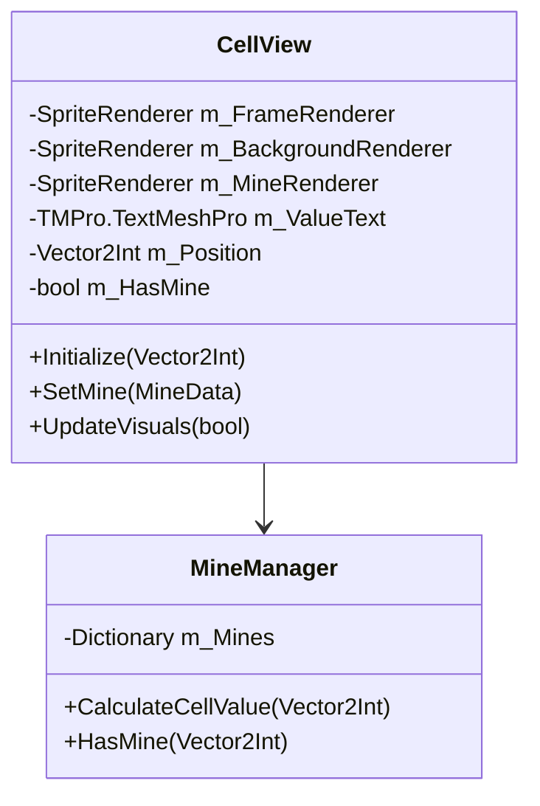
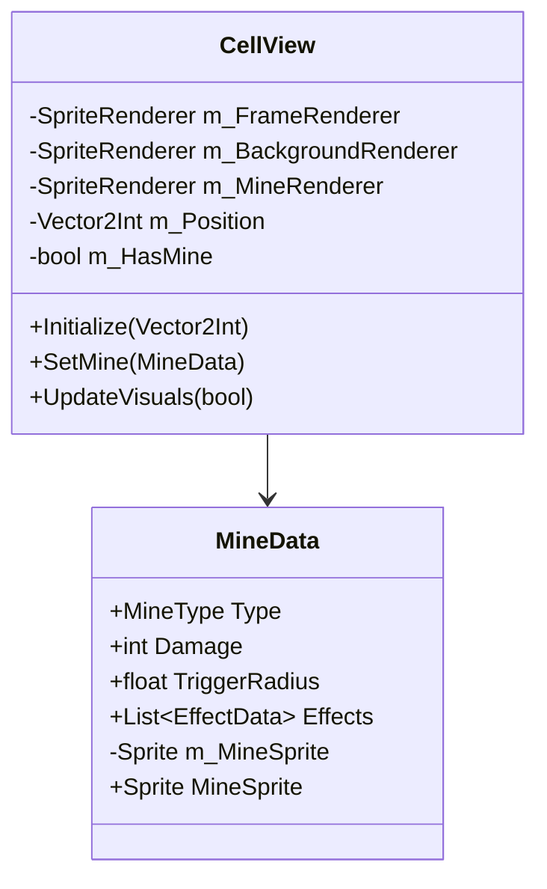
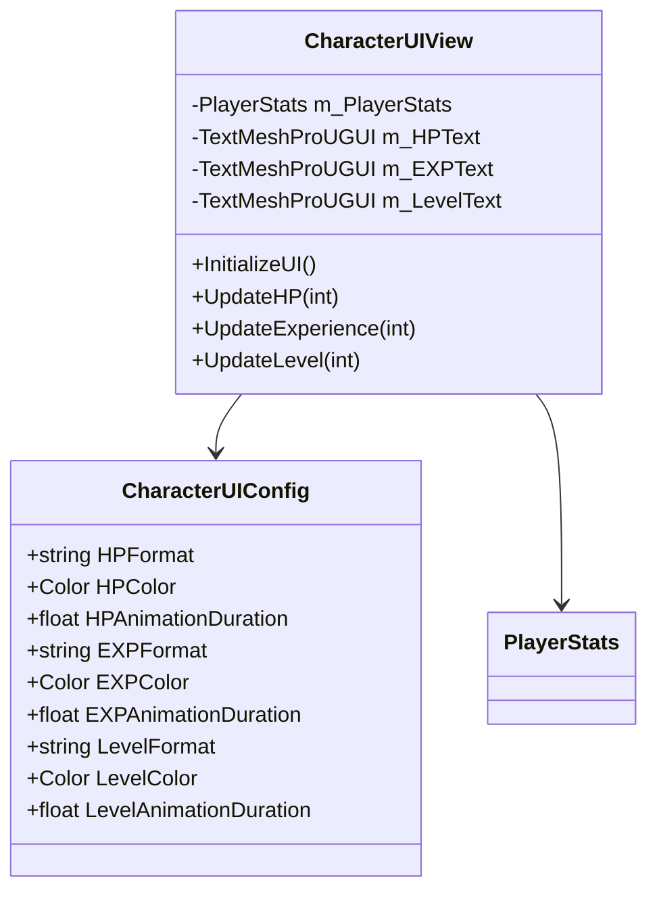

v0.1.3 - 2025-02-10 2025-02-09 23:24:57
# Overview
Enhanced the mine system with adjacent value calculation, providing players with numerical hints about nearby mines based on mine type values.

# Change Details
## New Features
### Mine Value System
- Implemented adjacent mine value calculation
- Added TextMeshPro display for numerical hints
- Integrated mine-specific values into hint system

## Adjustments and Refactoring
### Value Display System
- Modified cell value calculation to use mine-specific values
- Standardized number display with consistent red color
- Improved visual clarity of numerical hints

v0.1.2 - 2025-02-09 2025-02-09 22:25:10
# Overview
Enhanced the mine system with proper visualization and debugging capabilities. This update improves the visual representation of mines and adds developer tools for testing mine placement.

# Change Details
## New Features
### Mine Visualization System
- Implemented layered cell visualization with frame, background, and mine components
- Added sprite support to MineData for visual representation
- Created proper sorting order system for visual layers
- Integrated mine sprites with cell reveal mechanics

### Debug System
- Added MineDebugger tool for development testing
- Implemented F1 key shortcut for toggling mine visibility
- Added inspector button for mine visibility toggle
- Created color highlighting system for mine positions

## Adjustments and Refactoring
### Mine System Updates
- Connected MineManager with CellView components
- Improved mine placement validation
- Added proper error handling for mine configuration
- Enhanced grid position validation

v0.1.1 - 2025-02-06 17:04:54
# Overview
Added character UI system to display player stats, improving game feedback and player experience. This update introduces a configurable UI system that shows HP, Experience, and Level information in real-time.

# Change Details
## New Features
### Character UI System
- Implemented configurable UI system using ScriptableObjects
- Added real-time display of player stats:
  - HP with current/max values
  - Experience with progress to next level
  - Current level display
- Created event-driven UI updates
- Prepared animation system integration

## Adjustments and Refactoring
### Player System Updates
- Refactored Player class to inherit from MonoBehaviour
- Improved event handling and lifecycle management
- Added proper cleanup in OnDestroy

v0.1.0 - 2025-02-05 22:04:54
# Overview
Initial implementation of the RPG Minesweeper game, featuring core systems and basic gameplay mechanics. This update establishes the foundational architecture and implements essential features based on the design document.
## Change Details
### New Features
#### Core Grid System
- Implemented grid creation and management
- Added cell reveal mechanics
- Created visual representation with proper scaling
#### Mine System
- Implemented base mine functionality
- Added various mine types:
  - Healing Mine: Restores player HP
  - Experience Mine: Grants experience points
  - MultiTrigger Mine: Requires multiple triggers
  - AreaReveal Mine: Reveals surrounding cells
#### Player System
- Implemented HP and experience management
- Added leveling system with HP scaling
- Created event-driven stat updates
#### Event System
- Implemented centralized event management
- Added events for cell reveals, mine triggers, and effects
#### Camera System
- Added automatic camera positioning
- Implemented dynamic grid framing
- Added padding configuration
### Optimizations
#### Grid Optimization
- Centered grid positioning for better visibility
- Optimized cell instantiation
- Implemented proper scaling for different screen sizes
### Architecture Improvements
- Implemented SOLID principles throughout the codebase
- Created modular and extensible systems
- Established clear separation of concerns
- Added proper event-driven communication