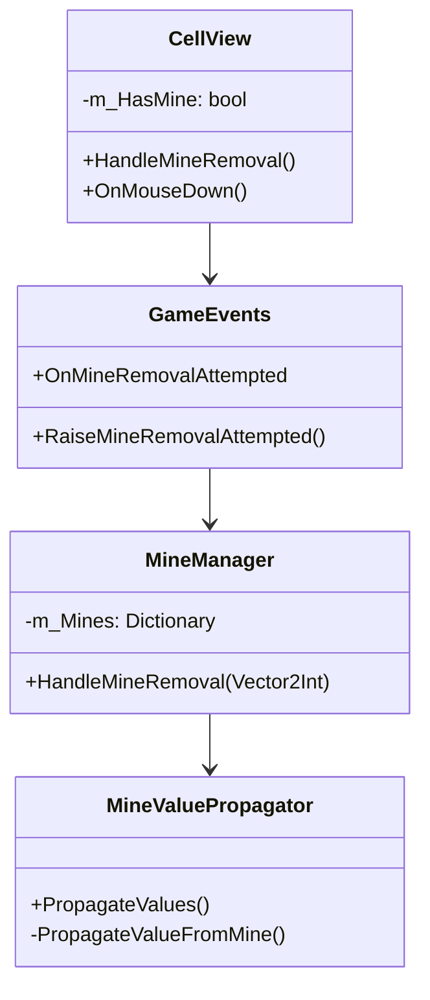
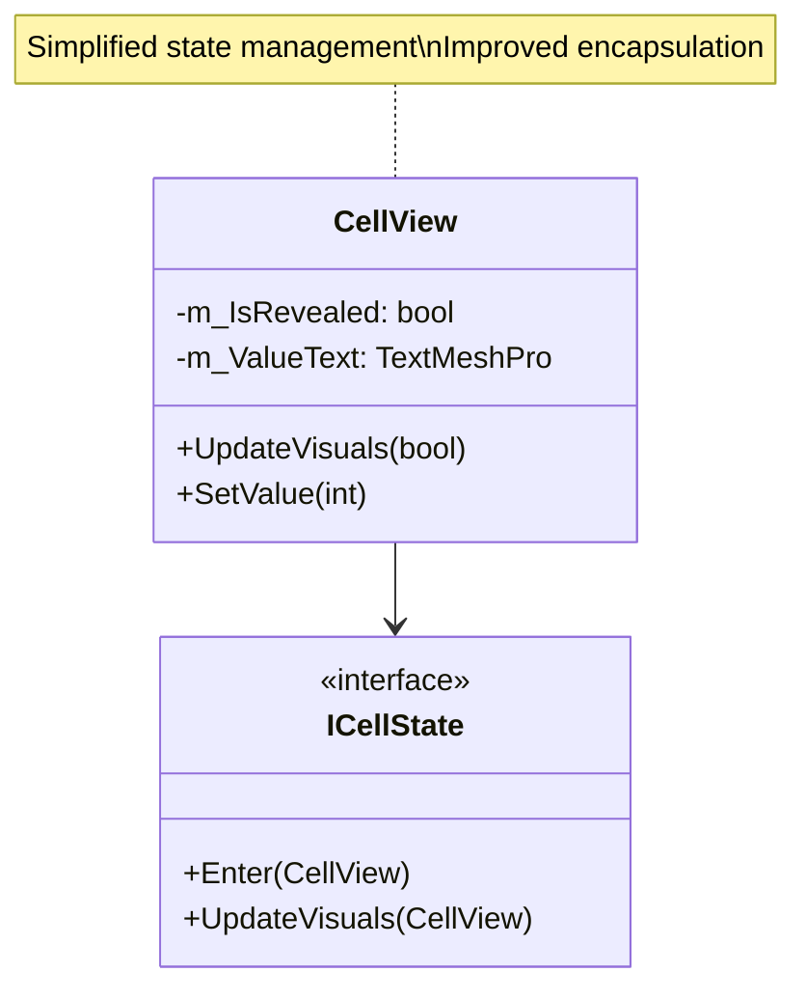
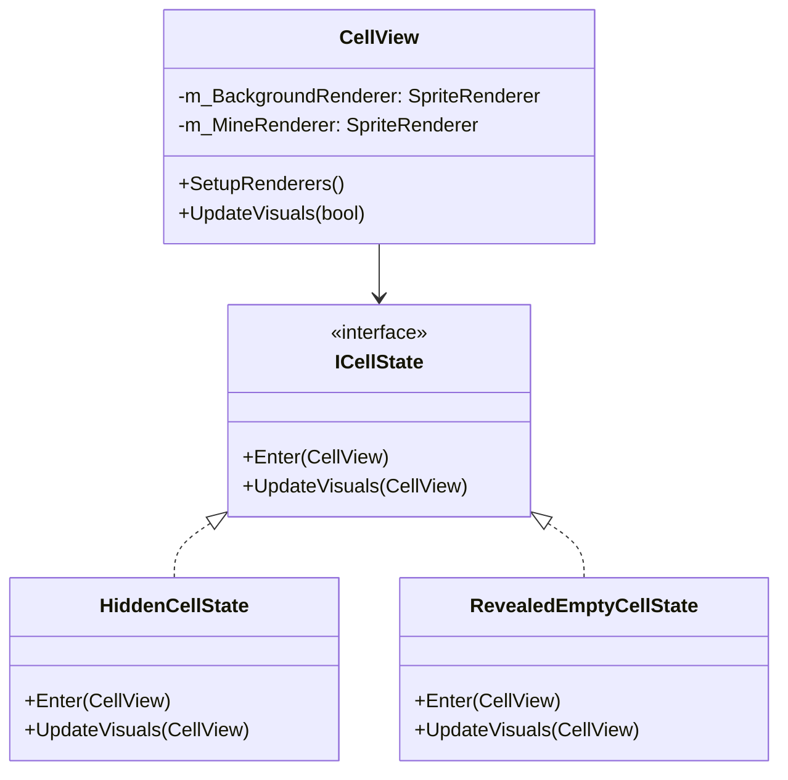
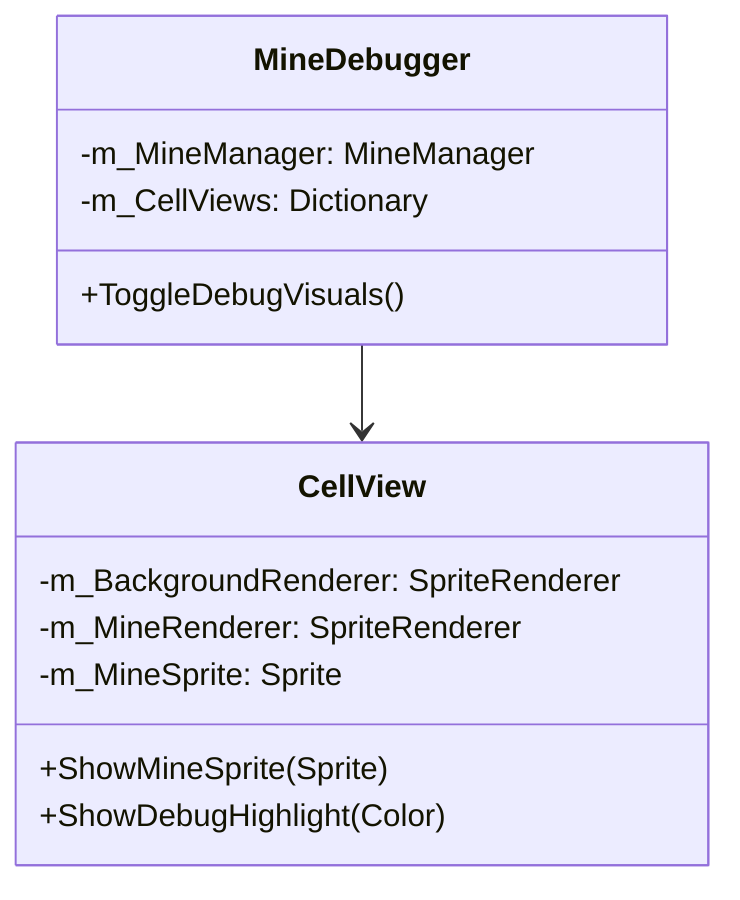

# v0.1.4 - 2025-02-12 04:17:50
## Overview
Added mine removal functionality with dynamic value recalculation, enhancing gameplay mechanics with the ability to remove revealed mines.

## Change Details
### New Features
#### Mine Removal System
- Added ability to remove mines by clicking on revealed mines
- Implemented automatic value recalculation for surrounding cells
- Added proper empty cell handling after mine removal

### Optimizations
- Improved value propagation system to handle empty cells
- Enhanced cell state management for mine removal
- Optimized value recalculation for better performance

# v0.1.3 - 2025-02-12 03:55:25
## Overview
Improved cell state management system with better encapsulation and simplified value text handling.

## Change Details
### Adjustments and Refactoring
#### Cell State Management
- Removed redundant value text visibility checks
- Consolidated visibility logic within state system
- Improved encapsulation by removing unnecessary public property

### Optimizations
- Reduced code duplication in visibility management
- Simplified state transitions
- Improved maintainability of cell view system

# v0.1.2 - 2024-02-12 02:30:13
## Overview
Fixed critical visualization issues in the cell reveal system, ensuring proper visual feedback when cells are revealed.

## Change Details
### Bug Fixes
#### Cell Visualization System
- Fixed sprite renderers not being enabled when cells are revealed
- Added proper renderer state management in cell state transitions
- Ensured consistent visual feedback for cell reveals

### Optimizations
#### Visual System Improvements
- Optimized sprite renderer state management
- Improved visual state transitions
- Enhanced error handling for missing renderers

# v0.1.1 - 2024-02-10 2025-02-10 02:32:41
## Overview
Enhanced the mine visualization system with proper sprite rendering and debug support. This update improves the visual feedback for mines and adds development tools for better debugging.

## Change Details
### New Features
#### Mine Visualization System
- Added separate sprite renderers for cell background and mine sprites
- Implemented proper sprite layer ordering
- Added mine sprite reveal system coordinated with cell reveals
- Created MineDebugger tool for development visualization

### Optimizations
#### Visual System Improvements
- Optimized sprite rendering with proper layer management
- Improved coordination between Grid and Mine managers for reveals
- Added extensive debug logging for development

### Architecture Improvements
- Enhanced separation of concerns in visual components
- Improved error handling and null checks
- Added development tools for better debugging

v0.1.0 - 2025-02-05
# Overview
Initial implementation of the RPG Minesweeper game, featuring core systems and basic gameplay mechanics. This update establishes the foundational architecture and implements essential features based on the design document.
## Change Details
### New Features
#### Core Grid System
- Implemented grid creation and management
- Added cell reveal mechanics
- Created visual representation with proper scaling
#### Mine System
- Implemented base mine functionality
- Added various mine types:
  - Healing Mine: Restores player HP
  - Experience Mine: Grants experience points
  - MultiTrigger Mine: Requires multiple triggers
  - AreaReveal Mine: Reveals surrounding cells
#### Player System
- Implemented HP and experience management
- Added leveling system with HP scaling
- Created event-driven stat updates
#### Event System
- Implemented centralized event management
- Added events for cell reveals, mine triggers, and effects
#### Camera System
- Added automatic camera positioning
- Implemented dynamic grid framing
- Added padding configuration
### Optimizations
#### Grid Optimization
- Centered grid positioning for better visibility
- Optimized cell instantiation
- Implemented proper scaling for different screen sizes
### Architecture Improvements
- Implemented SOLID principles throughout the codebase
- Created modular and extensible systems
- Established clear separation of concerns
- Added proper event-driven communication