# v0.1.20 - 2025-02-16 02:10:00
## Overview
Enhanced the mine spawn strategy system with flags-based composition, allowing flexible combination of different spawn patterns for more varied and strategic mine placement.

## Change Details
### Architecture Improvements
#### Flags-based Spawn Strategy System
- Converted MineSpawnStrategyType to flags enum for strategy composition
- Added new Corner and Center spawn strategies
- Implemented CompositeSpawnStrategy for handling multiple strategies
- Enhanced MineManager with strategy caching and composition
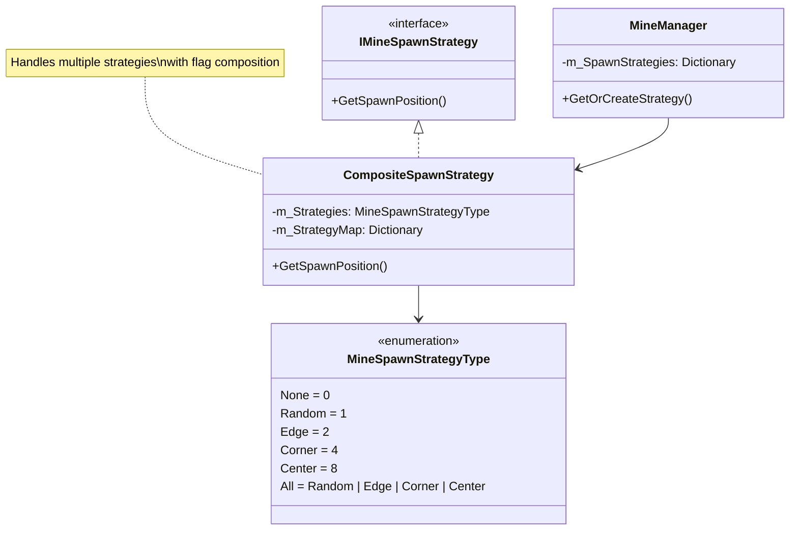
```mermaid
classDiagram
class MineSpawnStrategyType {
    <<enumeration>>
    None = 0
    Random = 1
    Edge = 2
    Corner = 4
    Center = 8
    All = Random | Edge | Corner | Center
}
class CompositeSpawnStrategy {
    -m_Strategies: MineSpawnStrategyType
    -m_StrategyMap: Dictionary
    +GetSpawnPosition()
}
class IMineSpawnStrategy {
    <<interface>>
    +GetSpawnPosition()
}
class MineManager {
    -m_SpawnStrategies: Dictionary
    +GetOrCreateStrategy()
}
IMineSpawnStrategy <|.. CompositeSpawnStrategy
MineManager --> CompositeSpawnStrategy
CompositeSpawnStrategy --> MineSpawnStrategyType
note for CompositeSpawnStrategy "Handles multiple strategies\nwith flag composition"
```

### Adjustments and Refactoring
#### Strategy Management System
- Improved strategy instantiation with caching
- Enhanced spawn position selection logic
- Added proper namespace organization
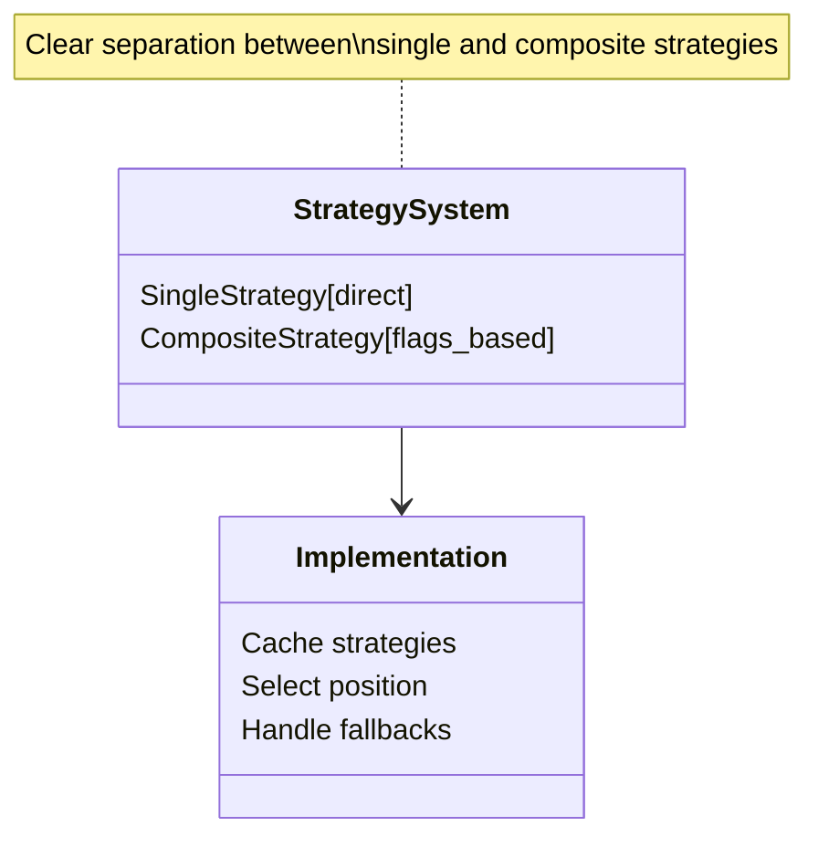
```mermaid
classDiagram
class StrategySystem {
    SingleStrategy[direct]
    CompositeStrategy[flags_based]
}
class Implementation {
    Cache strategies
    Select position
    Handle fallbacks
}
StrategySystem --> Implementation
note for StrategySystem "Clear separation between\nsingle and composite strategies"
```

### Optimizations
- Improved strategy instantiation through caching
- Enhanced spawn position selection efficiency
- Reduced redundant strategy creation

# v0.1.19 - 2025-02-16 00:57:00
## Overview
Added dynamic mine addition system with proper visual handling, enabling runtime mine placement with support for specific monster types.

## Change Details
### New Features
#### Dynamic Mine Addition System
- Implemented MineAddAttempted event with MonsterType support
- Added runtime mine creation with proper validation
- Enhanced visual handling for both hidden and revealed cells
- Created test component for development validation
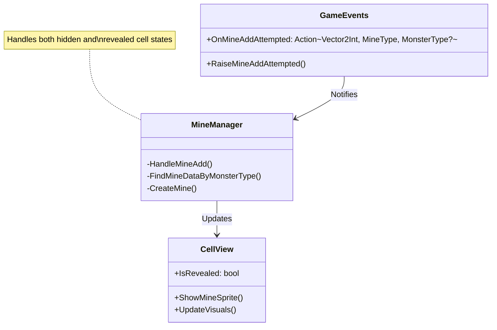
```mermaid
classDiagram
class GameEvents {
    +OnMineAddAttempted: Action~Vector2Int, MineType, MonsterType?~
    +RaiseMineAddAttempted()
}
class MineManager {
    -HandleMineAdd()
    -FindMineDataByMonsterType()
    -CreateMine()
}
class CellView {
    +IsRevealed: bool
    +ShowMineSprite()
    +UpdateVisuals()
}
GameEvents --> MineManager : Notifies
MineManager --> CellView : Updates
note for MineManager "Handles both hidden and\nrevealed cell states"
```

### Adjustments and Refactoring
#### Mine Creation System
- Enhanced mine data lookup by monster type
- Improved visual state handling for revealed cells
- Added proper validation for mine placement
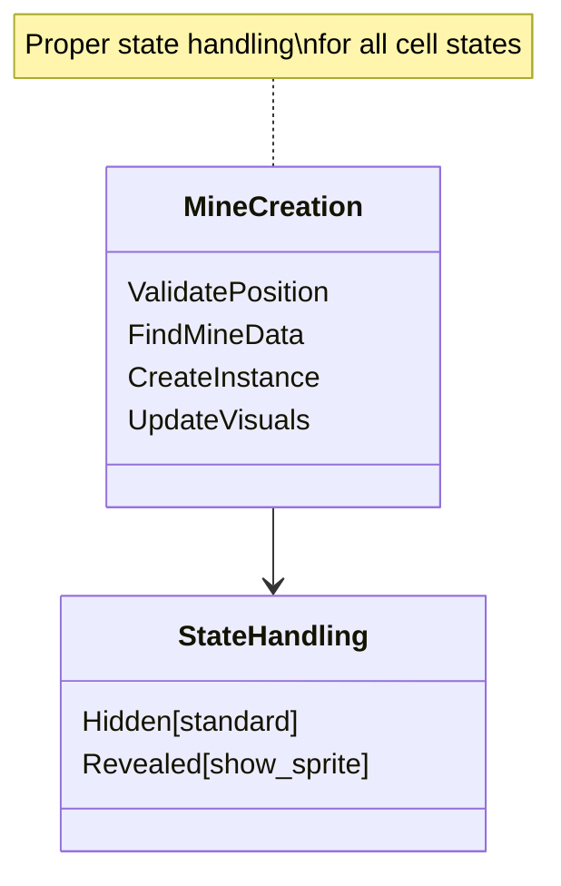
```mermaid
classDiagram
class MineCreation {
    ValidatePosition
    FindMineData
    CreateInstance
    UpdateVisuals
}
class StateHandling {
    Hidden[standard]
    Revealed[show_sprite]
}
MineCreation --> StateHandling
note for MineCreation "Proper state handling\nfor all cell states"
```

### Optimizations
- Improved mine data lookup efficiency
- Enhanced visual state management
- Optimized sprite handling for revealed cells

# v0.1.18 - 2025-02-15 23:15:00
## Overview
Enhanced the grid shape system with a new WholeGrid shape that enables effects to target the entire grid at once, improving support for global effects.

## Change Details
### New Features
#### WholeGrid Shape System
- Added WholeGrid shape type for grid-wide effects
- Implemented efficient grid-wide position calculation
- Enhanced shape helper with grid boundary awareness
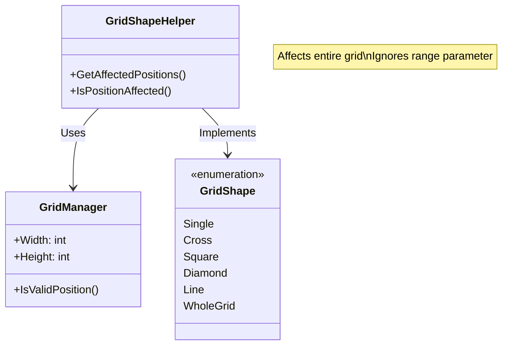
```mermaid
classDiagram
class GridShape {
    <<enumeration>>
    Single
    Cross
    Square
    Diamond
    Line
    WholeGrid
}
class GridShapeHelper {
    +GetAffectedPositions()
    +IsPositionAffected()
}
class GridManager {
    +Width: int
    +Height: int
    +IsValidPosition()
}
GridShapeHelper --> GridManager : Uses
GridShapeHelper --> GridShape : Implements
note for WholeGrid "Affects entire grid\nIgnores range parameter"
```

### Architecture Improvements
#### Shape System Enhancement
- Optimized position calculation for grid-wide effects
- Improved boundary checking with GridManager integration
- Enhanced shape helper extensibility
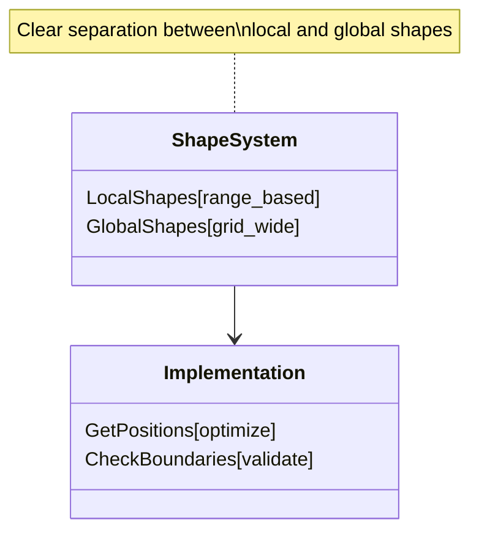
```mermaid
classDiagram
class ShapeSystem {
    LocalShapes[range_based]
    GlobalShapes[grid_wide]
}
class Implementation {
    GetPositions[optimize]
    CheckBoundaries[validate]
}
ShapeSystem --> Implementation
note for ShapeSystem "Clear separation between\nlocal and global shapes"
```

### Optimizations
- Improved position calculation efficiency for WholeGrid
- Enhanced grid boundary validation
- Optimized memory usage for position lists

# v0.1.17 - 2025-02-15 22:48:00
## Overview
Added a new targeted reveal effect system that allows revealing specific monster types, enhancing strategic gameplay with selective monster detection capabilities.

## Change Details
### New Features
#### Targeted Reveal Effect System
- Implemented TargetedRevealEffect for selective monster type revelation
- Added MonsterType classification system
- Enhanced effect template system with monster type targeting
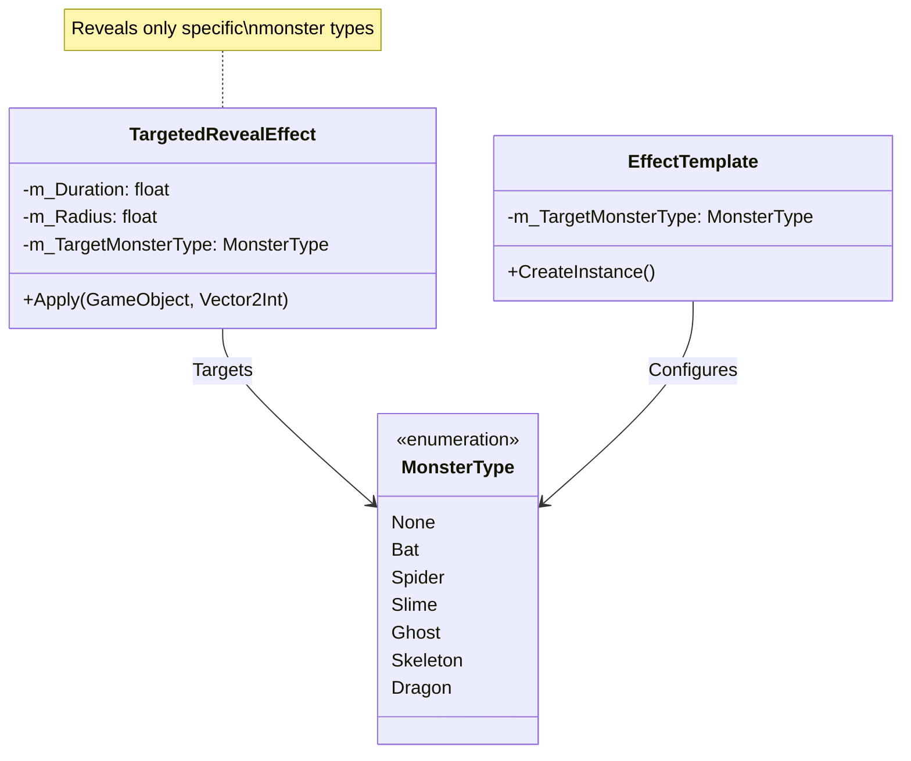
```mermaid
classDiagram
class TargetedRevealEffect {
    -m_Duration: float
    -m_Radius: float
    -m_TargetMonsterType: MonsterType
    +Apply(GameObject, Vector2Int)
}
class MonsterType {
    <<enumeration>>
    None
    Bat
    Spider
    Slime
    Ghost
    Skeleton
    Dragon
}
class EffectTemplate {
    -m_TargetMonsterType: MonsterType
    +CreateInstance()
}
TargetedRevealEffect --> MonsterType : Targets
EffectTemplate --> MonsterType : Configures
note for TargetedRevealEffect "Reveals only specific\nmonster types"
```

### Adjustments and Refactoring
#### Effect Property System
- Enhanced effect template system to support monster targeting
- Fixed radius value propagation from template to effect
- Improved effect creation pipeline
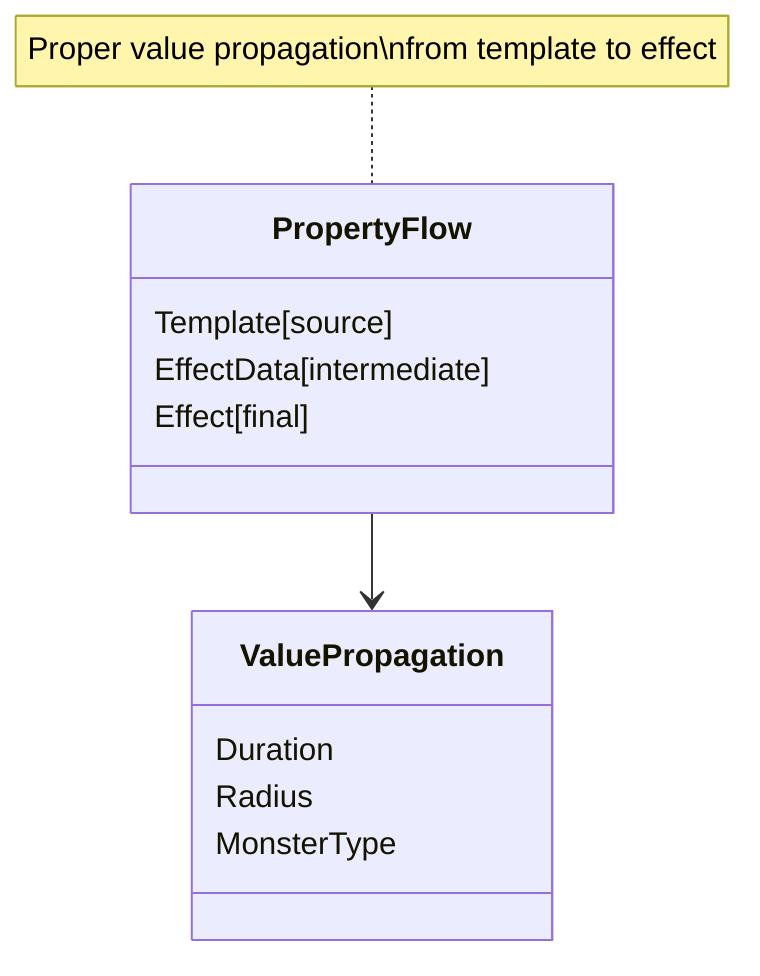
```mermaid
classDiagram
class PropertyFlow {
    Template[source]
    EffectData[intermediate]
    Effect[final]
}
class ValuePropagation {
    Duration
    Radius
    MonsterType
}
PropertyFlow --> ValuePropagation
note for PropertyFlow "Proper value propagation\nfrom template to effect"
```

### Optimizations
- Improved effect property propagation
- Enhanced template value management
- Optimized monster type targeting logic

# v0.1.16 - 2025-02-15 20:10:12
## Overview
Enhanced effect customization in MineData by implementing a template-based system, allowing per-mine customization of effect properties while maintaining template references.

## Change Details
### Architecture Improvements
#### Effect Template System
- Implemented EffectTemplate wrapper for effect customization
- Enhanced MineData to support per-instance effect property modifications
- Improved runtime effect instantiation with custom values
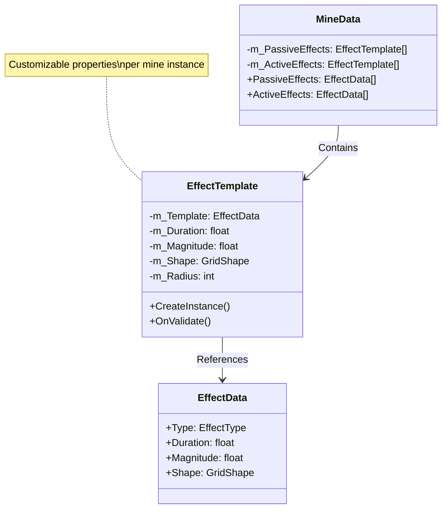
```mermaid
classDiagram
class EffectTemplate {
    -m_Template: EffectData
    -m_Duration: float
    -m_Magnitude: float
    -m_Shape: GridShape
    -m_Radius: int
    +CreateInstance()
    +OnValidate()
}
class MineData {
    -m_PassiveEffects: EffectTemplate[]
    -m_ActiveEffects: EffectTemplate[]
    +PassiveEffects: EffectData[]
    +ActiveEffects: EffectData[]
}
class EffectData {
    +Type: EffectType
    +Duration: float
    +Magnitude: float
    +Shape: GridShape
}
MineData --> EffectTemplate : Contains
EffectTemplate --> EffectData : References
note for EffectTemplate "Customizable properties\nper mine instance"
```

### Adjustments and Refactoring
#### Effect Property Management
- Separated template references from instance properties
- Enhanced inspector usability with proper value initialization
- Improved runtime instance creation
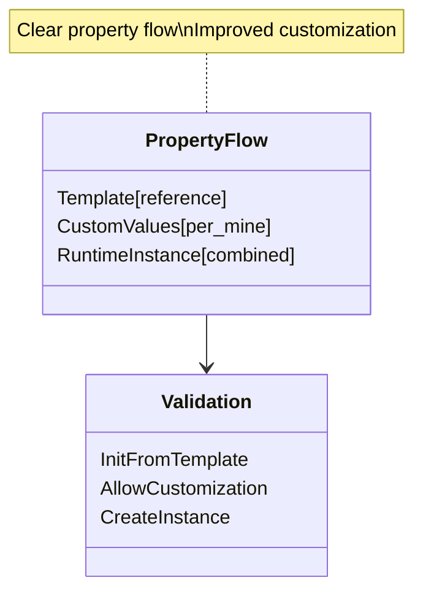
```mermaid
classDiagram
class PropertyFlow {
    Template[reference]
    CustomValues[per_mine]
    RuntimeInstance[combined]
}
class Validation {
    InitFromTemplate
    AllowCustomization
    CreateInstance
}
PropertyFlow --> Validation
note for PropertyFlow "Clear property flow\nImproved customization"
```

### Optimizations
- Improved effect property management
- Enhanced inspector usability
- Optimized runtime instance creation

# v0.1.15 - 2025-02-14 15:10:37
## Overview
Enhanced monster mine mechanics with a new collectable state system, improving gameplay feedback and strategic depth by requiring explicit collection of defeated monsters.

## Change Details
### New Features
#### Monster Mine Collection System
- Added collectable state for defeated monster mines
- Implemented two-phase removal process (combat + collection)
- Enhanced visual feedback for defeated state
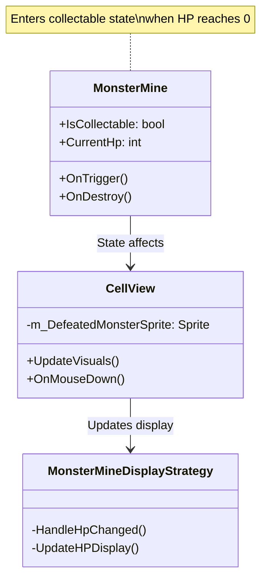
```mermaid
classDiagram
class MonsterMine {
    +IsCollectable: bool
    +CurrentHp: int
    +OnTrigger()
    +OnDestroy()
}
class CellView {
    -m_DefeatedMonsterSprite: Sprite
    +UpdateVisuals()
    +OnMouseDown()
}
class MonsterMineDisplayStrategy {
    -HandleHpChanged()
    -UpdateHPDisplay()
}
MonsterMine --> CellView : State affects
CellView --> MonsterMineDisplayStrategy : Updates display
note for MonsterMine "Enters collectable state\nwhen HP reaches 0"
```

### Adjustments and Refactoring
#### Visual Update System
- Fixed stack overflow in visual update chain
- Improved sprite visibility management
- Enhanced state transition handling
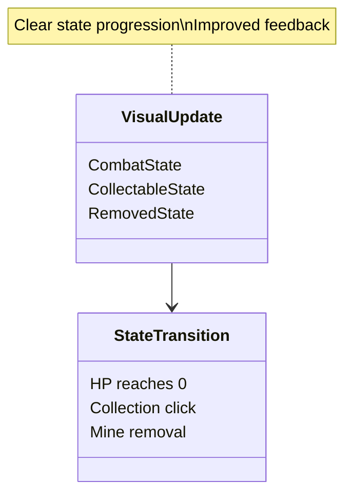
```mermaid
classDiagram
class VisualUpdate {
    CombatState
    CollectableState
    RemovedState
}
class StateTransition {
    HP reaches 0
    Collection click
    Mine removal
}
VisualUpdate --> StateTransition
note for VisualUpdate "Clear state progression\nImproved feedback"
```

### Optimizations
- Optimized visual update system to prevent circular updates
- Improved state management efficiency
- Enhanced sprite and text visibility control

# v0.1.14 - 2025-02-14 16:00:00
## Overview
Enhanced monster mine mechanics by adding a defeated state and restricting removal until defeated, improving gameplay clarity and strategic depth.

## Change Details
### New Features
#### Monster Mine Defeat System
- Added visual indication for defeated monster mines
- Restricted monster mine removal until HP reaches zero
- Enhanced feedback for monster mine state
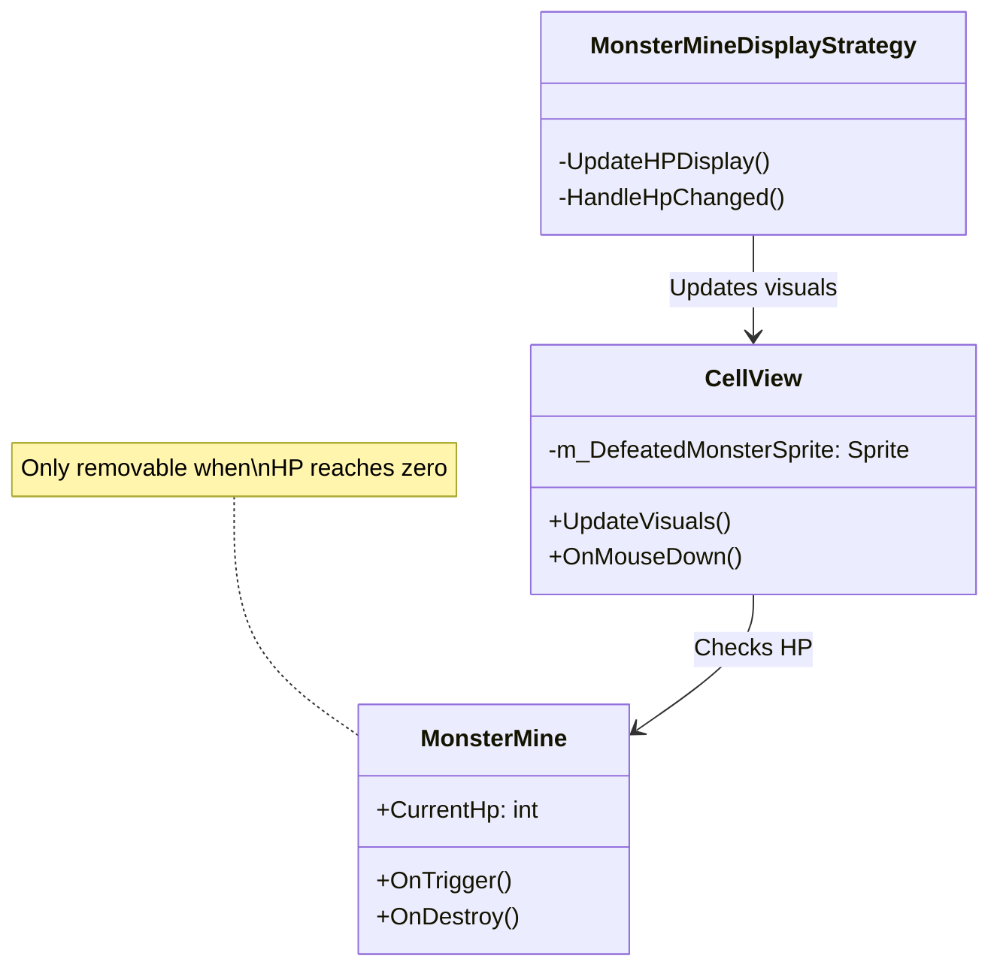
```mermaid
classDiagram
class CellView {
    -m_DefeatedMonsterSprite: Sprite
    +UpdateVisuals()
    +OnMouseDown()
}
class MonsterMine {
    +CurrentHp: int
    +OnTrigger()
    +OnDestroy()
}
class MonsterMineDisplayStrategy {
    -UpdateHPDisplay()
    -HandleHpChanged()
}
CellView --> MonsterMine : Checks HP
MonsterMineDisplayStrategy --> CellView : Updates visuals
note for MonsterMine "Only removable when\nHP reaches zero"
```

### Adjustments and Refactoring
#### Monster Mine Interaction
- Updated cell interaction logic for monster mines
- Enhanced visual feedback for defeated state
- Improved monster mine removal conditions
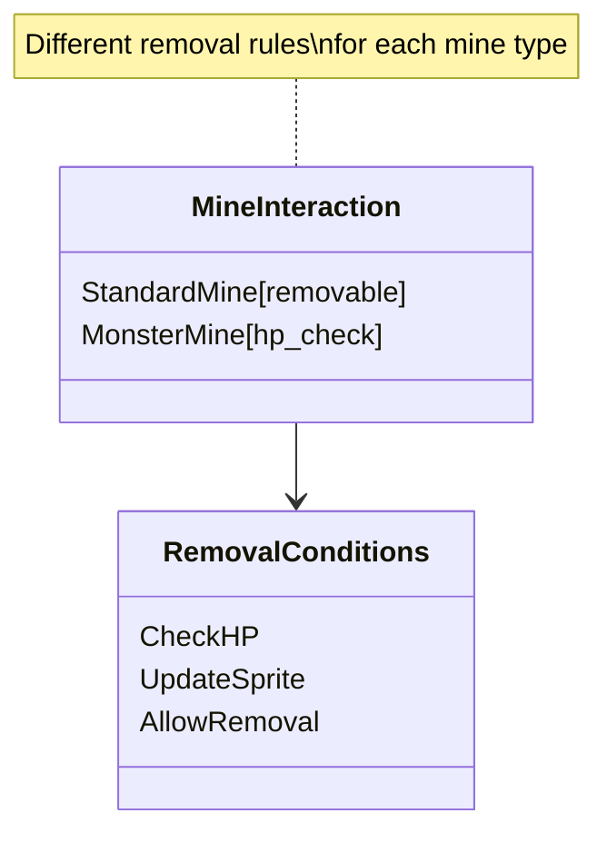
```mermaid
classDiagram
class MineInteraction {
    StandardMine[removable]
    MonsterMine[hp_check]
}
class RemovalConditions {
    CheckHP
    UpdateSprite
    AllowRemoval
}
MineInteraction --> RemovalConditions
note for MineInteraction "Different removal rules\nfor each mine type"
```

### Optimizations
- Improved monster mine state management
- Enhanced visual feedback system
- Streamlined mine removal logic

# v0.1.13 - 2025-02-14 14:01:07
## Overview
Enhanced the display configuration system with distinct text positions for different cell types, providing better visual organization and customization options.

## Change Details
### New Features
#### Enhanced Display Configuration
- Added separate position configurations for empty cells, standard mines, and monster mines
- Implemented proper position inheritance in display strategies
- Enhanced visual clarity with dedicated positions for each display type
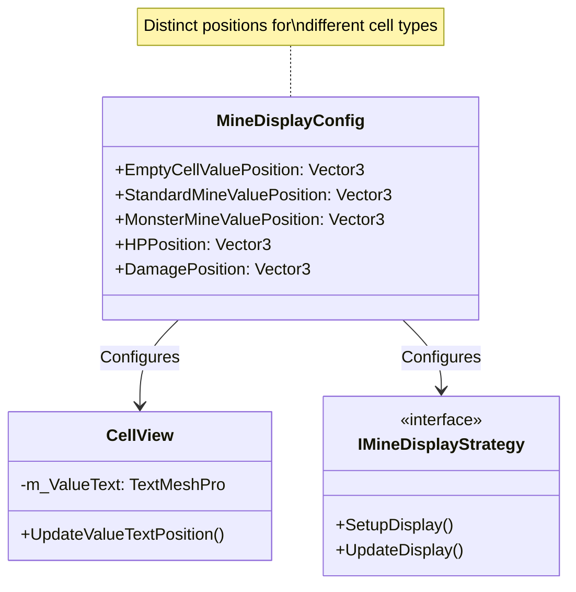
```mermaid
classDiagram
class MineDisplayConfig {
    +EmptyCellValuePosition: Vector3
    +StandardMineValuePosition: Vector3
    +MonsterMineValuePosition: Vector3
    +HPPosition: Vector3
    +DamagePosition: Vector3
}
class CellView {
    -m_ValueText: TextMeshPro
    +UpdateValueTextPosition()
}
class IMineDisplayStrategy {
    <<interface>>
    +SetupDisplay()
    +UpdateDisplay()
}
MineDisplayConfig --> CellView : Configures
MineDisplayConfig --> IMineDisplayStrategy : Configures
note for MineDisplayConfig "Distinct positions for\ndifferent cell types"
```

### Adjustments and Refactoring
#### Display Position System
- Refactored position handling in display strategies
- Enhanced position update logic in CellView
- Improved visual consistency across different cell types
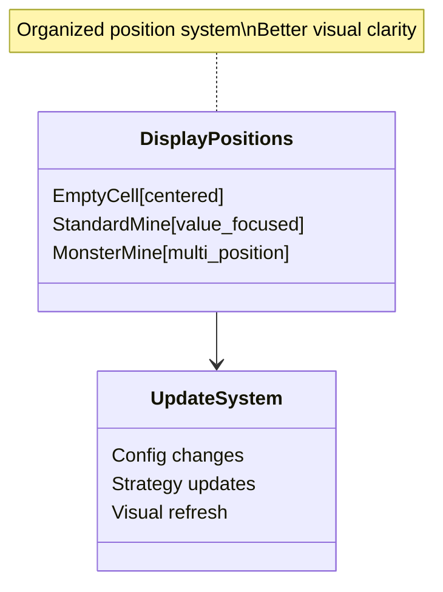
```mermaid
classDiagram
class DisplayPositions {
    EmptyCell[centered]
    StandardMine[value_focused]
    MonsterMine[multi_position]
}
class UpdateSystem {
    Config changes
    Strategy updates
    Visual refresh
}
DisplayPositions --> UpdateSystem
note for DisplayPositions "Organized position system\nBetter visual clarity"
```

### Optimizations
- Improved position management efficiency
- Enhanced visual consistency across cell types
- Reduced position calculation overhead

# v0.1.12 - 2025-02-14 11:11:07
## Overview
Fixed real-time HP display updates for monster mines and improved the display strategy system's event handling, enhancing visual feedback reliability.

## Change Details
### Bug Fixes
#### Monster HP Display System
- Fixed HP display not updating in real-time for monster mines
- Implemented proper event subscription system for HP changes
- Enhanced cleanup of display resources and event handlers
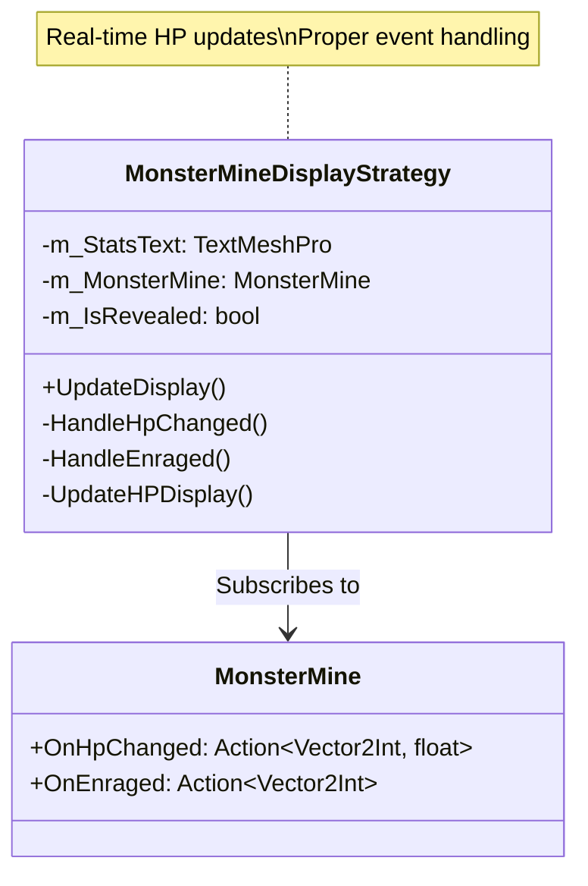
```mermaid
classDiagram
class MonsterMineDisplayStrategy {
    -m_StatsText: TextMeshPro
    -m_MonsterMine: MonsterMine
    -m_IsRevealed: bool
    +UpdateDisplay()
    -HandleHpChanged()
    -HandleEnraged()
    -UpdateHPDisplay()
}
class MonsterMine {
    +OnHpChanged: Action~Vector2Int, float~
    +OnEnraged: Action~Vector2Int~
}
MonsterMineDisplayStrategy --> MonsterMine : Subscribes to
note for MonsterMineDisplayStrategy "Real-time HP updates\nProper event handling"
```

### Optimizations
- Improved display update efficiency with separate update methods
- Enhanced memory management through proper event cleanup
- Reduced unnecessary visual updates

# v0.1.11 - 2025-02-13 23:03:41
## Overview
Removed speed-related functionality and enhanced shield mechanics to better align with the game's pure grid-based nature, while improving code quality and fixing linter errors.

## Change Details
### Adjustments and Refactoring
#### Speed System Removal
- Removed all speed-related functionality
- Deleted SpeedEffect class and enum entry
- Cleaned up movement code from PlayerComponent
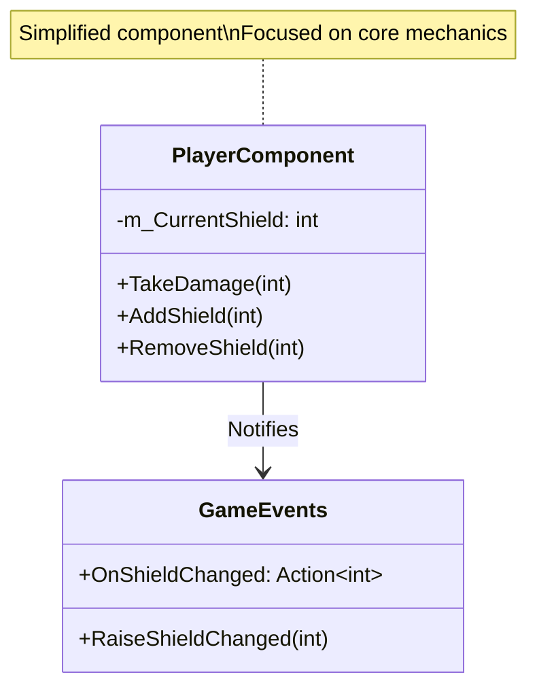
```mermaid
classDiagram
class PlayerComponent {
    -m_CurrentShield: int
    +TakeDamage(int)
    +AddShield(int)
    +RemoveShield(int)
}
class GameEvents {
    +OnShieldChanged: Action~int~
    +RaiseShieldChanged(int)
}
PlayerComponent --> GameEvents : Notifies
note for PlayerComponent "Simplified component\nFocused on core mechanics"
```

#### Shield System Enhancement
- Added shield change event system
- Implemented proper shield notifications
- Fixed linter errors in shield-related code
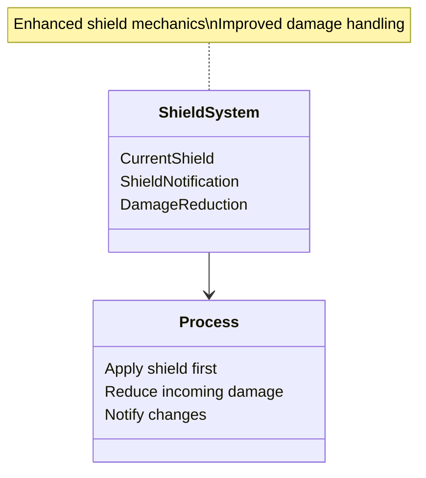
```mermaid
classDiagram
class ShieldSystem {
    CurrentShield
    ShieldNotification
    DamageReduction
}
class Process {
    Apply shield first
    Reduce incoming damage
    Notify changes
}
ShieldSystem --> Process
note for ShieldSystem "Enhanced shield mechanics\nImproved damage handling"
```

### Optimizations
- Improved code encapsulation
- Enhanced shield damage reduction logic
- Fixed linter errors in PlayerComponent
- Removed redundant speed-related code

# v0.1.10 - 2025-02-13 16:34:22
## Overview
Enhanced mine visualization system with customizable value colors and improved positioning logic for zero-value mines, providing better visual clarity and customization options.

## Change Details
### New Features
#### Mine Value Color Customization
- Added MineValueColor property to MineData for custom mine value text colors
- Implemented separate color handling for mine values vs. regular cell values
- Enhanced visual consistency with proper color inheritance
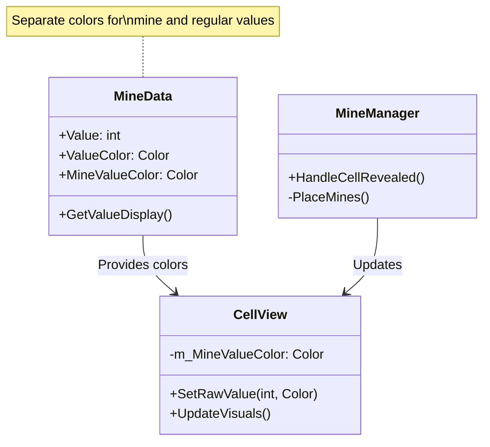
```mermaid
classDiagram
class MineData {
    +Value: int
    +ValueColor: Color
    +MineValueColor: Color
    +GetValueDisplay()
}
class CellView {
    -m_MineValueColor: Color
    +SetRawValue(int, Color)
    +UpdateVisuals()
}
class MineManager {
    +HandleCellRevealed()
    -PlaceMines()
}
MineData --> CellView : Provides colors
MineManager --> CellView : Updates
note for MineData "Separate colors for\nmine and regular values"
```

### Adjustments and Refactoring
#### Mine Sprite Positioning
- Improved mine sprite positioning logic for zero-value mines
- Centered both sprite and value text for mines with zero value
- Enhanced visual consistency across different mine types
```mermaid
classDiagram
class CellView {
    -m_MineOffset: Vector3
    -m_ValueOffset: Vector3
    +ShowMineSprite()
    +UpdateValueTextPosition()
}
class SpritePosition {
    ZeroValue[centered]
    NonZeroValue[offset]
}
CellView --> SpritePosition
note for CellView "Dynamic positioning based\non mine value"
```

### Optimizations
- Improved visual consistency for mine display
- Enhanced code organization for sprite positioning
- Optimized color management system

# v0.1.9 - 2025-02-13 15:51:24
## Overview
Improved effect color visualization system by properly separating effect-based colors from regular value display, enhancing visual clarity and maintaining consistent color application across the game.

## Change Details
### Architecture Improvements
#### Value Display System
- Refactored color handling to properly separate effect colors from base values
- Centralized color modification logic in MineValueModifier
- Enhanced consistency between normal and debug visualization
```mermaid
classDiagram
class MineValueModifier {
-s_ActiveEffects: Dictionary
+ModifyValue(Vector2Int, int)
+ModifyValueAndGetColor(Vector2Int, int)
}
class MineValuePropagator {
+PropagateValues()
-PropagateValueFromMine()
}
class CellView {
-m_CurrentValue: int
-m_CurrentValueColor: Color
+SetValue(int, Color)
}
MineValuePropagator --> MineValueModifier : Uses
CellView --> MineValueModifier : Gets colors
note for MineValueModifier "Handles both value and color\nmodifications centrally"
```

### Adjustments and Refactoring
#### Color Management System
- Removed color tracking from value propagation
- Improved effect color application consistency
- Enhanced debug visualization color handling
```mermaid
classDiagram
class ValueDisplay {
BaseValue[white]
EffectValue[colored]
}
class ColorSource {
Regular[white]
Effect[pink]
}
ValueDisplay --> ColorSource
note for ColorSource "Clear separation between\neffect and regular colors"
```

### Optimizations
- Simplified color management logic
- Reduced redundant color calculations
- Improved visual consistency across systems

# v0.1.8 - 2025-02-12 16:50:06
## Overview
Implemented centralized value modification system to improve effect persistence and independence, enhancing the reliability and maintainability of effect-based value modifications.

## Change Details
### Architecture Improvements
#### Value Modification System
- Added MineValueModifier for centralized effect tracking
- Improved separation between base value calculation and effect modifications
- Enhanced effect persistence and independence
```mermaid
classDiagram
class MineValueModifier {
-s_ActiveEffects: Dictionary
+RegisterEffect(Vector2Int, IEffect)
+UnregisterEffect(Vector2Int, IEffect)
+ModifyValue(Vector2Int, int)
}
class MineValuePropagator {
+PropagateValues()
-PropagateValueFromMine()
}
class ConfusionEffect {
-m_AffectedCells: HashSet
+Apply()
+Remove()
}
MineValuePropagator --> MineValueModifier : Uses
ConfusionEffect --> MineValueModifier : Registers
note for MineValueModifier "Centralized effect tracking\nHandles value modifications"
```

### Adjustments and Refactoring
#### Value Calculation System
- Separated base value calculation from effect modifications
- Enhanced effect persistence through centralized tracking
- Improved value recalculation reliability

```mermaid
classDiagram
class ValueCalculation {
BaseValue
EffectModification
FinalDisplay
}
class Process {
Calculate base values
Apply effect modifications
Update cell displays
}
ValueCalculation --> Process
note for ValueCalculation "Clear separation of concerns\nImproved maintainability"
```

### Optimizations
- Improved effect persistence management
- Enhanced value calculation efficiency
- Reduced redundant recalculations

# v0.1.7 - 2025-02-12 15:21:49
## Overview
Added new confusion effect system that obscures mine values with question marks in configurable shapes, enhancing gameplay mechanics with visual deception elements.

## Change Details
### New Features
#### Confusion Effect System
- Implemented new ConfusionEffect that displays "?" instead of numeric values
- Added shape-based area of effect using existing GridShape system
- Integrated with passive effect system for periodic updates
- Added automatic value restoration when effect is removed
```mermaid
classDiagram
class ConfusionEffect {
-m_Duration: float
-m_Radius: int
-m_Shape: GridShape
-m_AffectedCells: HashSet
+Apply(GameObject, Vector2Int)
+Remove(GameObject, Vector2Int)
+OnTick(GameObject, Vector2Int)
}
class CellView {
-m_ValueText: TextMeshPro
-m_CurrentValue: int
+SetValue(int)
+UpdateVisuals()
}
class GridShapeHelper {
+GetAffectedPositions(Vector2Int, GridShape, int)
}
ConfusionEffect --> CellView : Updates
ConfusionEffect --> GridShapeHelper : Uses
note for ConfusionEffect "Manages confused state\nSupports multiple shapes"
note for CellView "Displays ? for value -1"
```

### Architecture Improvements
- Enhanced effect system extensibility with shape support
- Improved separation of concerns in value display logic
- Added proper value state management for special cases

### Adjustments and Refactoring
#### Value Display System
- Enhanced CellView to handle special -1 value case
- Improved value persistence through visual updates
- Added shape-based area calculation
```mermaid
classDiagram
class PassiveEffectData {
+Type: EffectType
+Shape: GridShape
+Radius: int
+CreateEffect()
}
class EffectType {
<<enumeration>>
Confusion
Other_Effects
}
PassiveEffectData --> EffectType
note for PassiveEffectData "Configurable shape and radius\nSupports confusion effect"
```

# v0.1.6 - 2025-02-12 14:40:44
## Overview
Simplified cell value visualization system by improving encapsulation and removing debug-specific logic from CellView.

## Change Details
### Adjustments and Refactoring
#### Cell Value Visualization
- Removed debug mode from CellView class
- Consolidated value text visibility logic
- Simplified visual state management
- Improved separation of concerns between CellView and MineDebugger
```mermaid
classDiagram
class CellView {
-m_ValueText: TextMeshPro
-m_CurrentValue: int
-m_IsRevealed: bool
+UpdateVisuals()
+SetValue(int)
}
class MineDebugger {
-m_CachedValues: Dictionary
+ToggleDebugVisuals()
-CalculateAllCellValues()
}
CellView <-- MineDebugger : Updates
note for CellView "Simplified value display logic\nImproved encapsulation"
note for MineDebugger "Handles debug visualization"
```

### Optimizations
- Reduced code complexity in CellView
- Improved maintainability of value display system
- Enhanced separation of debug and core visualization logic

# v0.1.5 - 2025-02-12 07:40:50
## Overview
Implemented strategy pattern for mine spawning system, enhancing flexibility and extensibility of mine placement mechanics.

## Change Details
### Adjustments and Refactoring
#### Mine Spawn System
- Introduced strategy pattern for mine spawning
- Added random and edge spawn strategies
- Enhanced MineData with spawn strategy selection
```mermaid
classDiagram
    class IMineSpawnStrategy {
        <<interface>>
        +GetSpawnPosition(GridManager, Dictionary)
    }
    class RandomMineSpawnStrategy {
        +GetSpawnPosition(GridManager, Dictionary)
    }
    class EdgeMineSpawnStrategy {
        +GetSpawnPosition(GridManager, Dictionary)
    }
    class MineData {
        +SpawnStrategy: MineSpawnStrategyType
    }
    class MineManager {
        -m_SpawnStrategies: Dictionary
        +GetSpawnPosition(MineData)
    }
    IMineSpawnStrategy <|.. RandomMineSpawnStrategy
    IMineSpawnStrategy <|.. EdgeMineSpawnStrategy
    MineManager --> IMineSpawnStrategy
    MineData --> MineSpawnStrategyType
```

### Architecture Improvements
- Enhanced modularity of mine spawning system
- Improved extensibility for future spawn strategies
- Better separation of concerns in mine placement logic

# v0.1.4 - 2025-02-12 04:17:50
## Overview
Added mine removal functionality with dynamic value recalculation, enhancing gameplay mechanics with the ability to remove revealed mines.

## Change Details
### New Features
#### Mine Removal System
- Added ability to remove mines by clicking on revealed mines
- Implemented automatic value recalculation for surrounding cells
- Added proper empty cell handling after mine removal
```mermaid
classDiagram
    class CellView {
        -m_HasMine: bool
        +HandleMineRemoval()
        +OnMouseDown()
    }
    class MineManager {
        -m_Mines: Dictionary
        +HandleMineRemoval(Vector2Int)
    }
    class MineValuePropagator {
        +PropagateValues()
        -PropagateValueFromMine()
    }
    class GameEvents {
        +OnMineRemovalAttempted
        +RaiseMineRemovalAttempted()
    }
    CellView --> GameEvents
    MineManager --> MineValuePropagator
    GameEvents --> MineManager
```

### Optimizations
- Improved value propagation system to handle empty cells
- Enhanced cell state management for mine removal
- Optimized value recalculation for better performance

# v0.1.3 - 2025-02-12 03:55:25
## Overview
Improved cell state management system with better encapsulation and simplified value text handling.

## Change Details
### Adjustments and Refactoring
#### Cell State Management
- Removed redundant value text visibility checks
- Consolidated visibility logic within state system
- Improved encapsulation by removing unnecessary public property
```mermaid
classDiagram
    class CellView {
        -m_IsRevealed: bool
        -m_ValueText: TextMeshPro
        +UpdateVisuals(bool)
        +SetValue(int)
    }
    class ICellState {
        <<interface>>
        +Enter(CellView)
        +UpdateVisuals(CellView)
    }
    CellView --> ICellState
    note for CellView "Simplified state management\nImproved encapsulation"
```

### Optimizations
- Reduced code duplication in visibility management
- Simplified state transitions
- Improved maintainability of cell view system

# v0.1.2 - 2024-02-12 02:30:13
## Overview
Fixed critical visualization issues in the cell reveal system, ensuring proper visual feedback when cells are revealed.

## Change Details
### Bug Fixes
#### Cell Visualization System
- Fixed sprite renderers not being enabled when cells are revealed
- Added proper renderer state management in cell state transitions
- Ensured consistent visual feedback for cell reveals
```mermaid
classDiagram
    class CellView {
        -m_BackgroundRenderer: SpriteRenderer
        -m_MineRenderer: SpriteRenderer
        +SetupRenderers()
        +UpdateVisuals(bool)
    }
    class ICellState {
        <<interface>>
        +Enter(CellView)
        +UpdateVisuals(CellView)
    }
    class HiddenCellState {
        +Enter(CellView)
        +UpdateVisuals(CellView)
    }
    class RevealedEmptyCellState {
        +Enter(CellView)
        +UpdateVisuals(CellView)
    }
    ICellState <|.. HiddenCellState
    ICellState <|.. RevealedEmptyCellState
    CellView --> ICellState
```

### Optimizations
#### Visual System Improvements
- Optimized sprite renderer state management
- Improved visual state transitions
- Enhanced error handling for missing renderers

# v0.1.1 - 2024-02-10 2025-02-10 02:32:41
## Overview
Enhanced the mine visualization system with proper sprite rendering and debug support. This update improves the visual feedback for mines and adds development tools for better debugging.

## Change Details
### New Features
#### Mine Visualization System
- Added separate sprite renderers for cell background and mine sprites
- Implemented proper sprite layer ordering
- Added mine sprite reveal system coordinated with cell reveals
- Created MineDebugger tool for development visualization
```mermaid
classDiagram
    class CellView {
        -m_BackgroundRenderer: SpriteRenderer
        -m_MineRenderer: SpriteRenderer
        -m_MineSprite: Sprite
        +ShowMineSprite(Sprite)
        +ShowDebugHighlight(Color)
    }
    class MineDebugger {
        -m_MineManager: MineManager
        -m_CellViews: Dictionary
        +ToggleDebugVisuals()
    }
    MineDebugger --> CellView
```

### Optimizations
#### Visual System Improvements
- Optimized sprite rendering with proper layer management
- Improved coordination between Grid and Mine managers for reveals
- Added extensive debug logging for development

### Architecture Improvements
- Enhanced separation of concerns in visual components
- Improved error handling and null checks
- Added development tools for better debugging

v0.1.0 - 2025-02-05
# Overview
Initial implementation of the RPG Minesweeper game, featuring core systems and basic gameplay mechanics. This update establishes the foundational architecture and implements essential features based on the design document.
## Change Details
### New Features
#### Core Grid System
- Implemented grid creation and management
- Added cell reveal mechanics
- Created visual representation with proper scaling
#### Mine System
- Implemented base mine functionality
- Added various mine types:
  - Healing Mine: Restores player HP
  - Experience Mine: Grants experience points
  - MultiTrigger Mine: Requires multiple triggers
  - AreaReveal Mine: Reveals surrounding cells
#### Player System
- Implemented HP and experience management
- Added leveling system with HP scaling
- Created event-driven stat updates
#### Event System
- Implemented centralized event management
- Added events for cell reveals, mine triggers, and effects
#### Camera System
- Added automatic camera positioning
- Implemented dynamic grid framing
- Added padding configuration
### Optimizations
#### Grid Optimization
- Centered grid positioning for better visibility
- Optimized cell instantiation
- Implemented proper scaling for different screen sizes
### Architecture Improvements
- Implemented SOLID principles throughout the codebase
- Created modular and extensible systems
- Established clear separation of concerns
- Added proper event-driven communication
