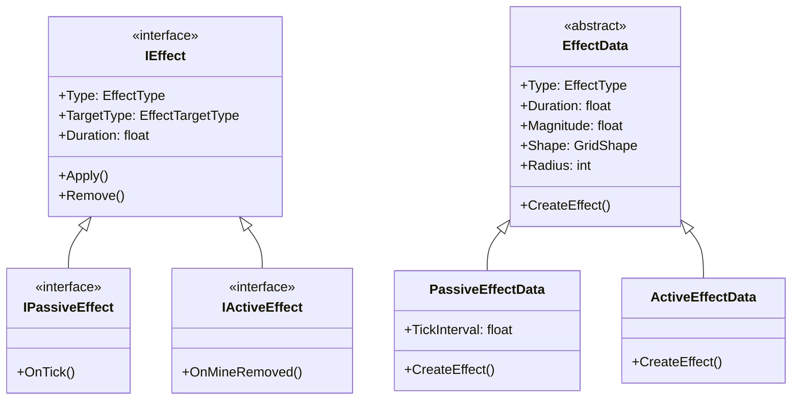
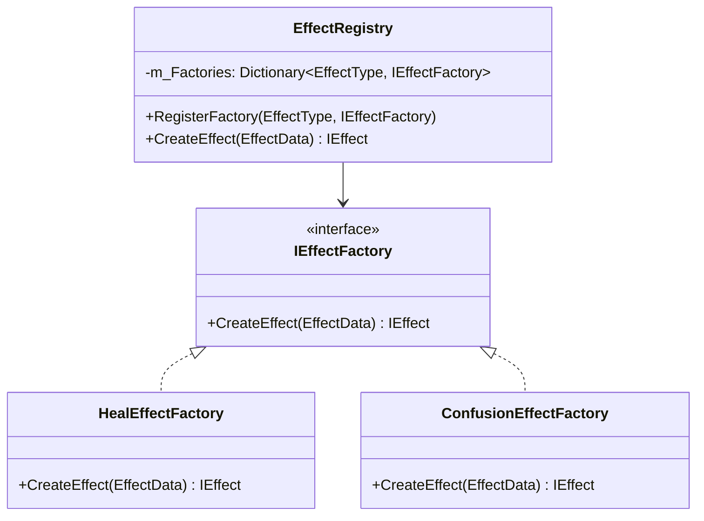
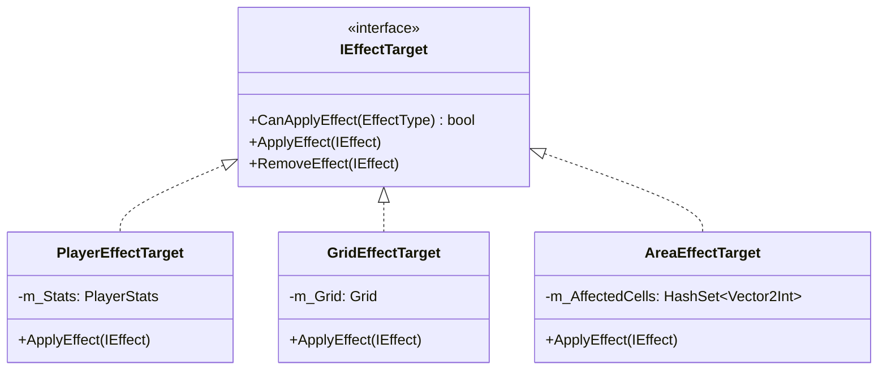
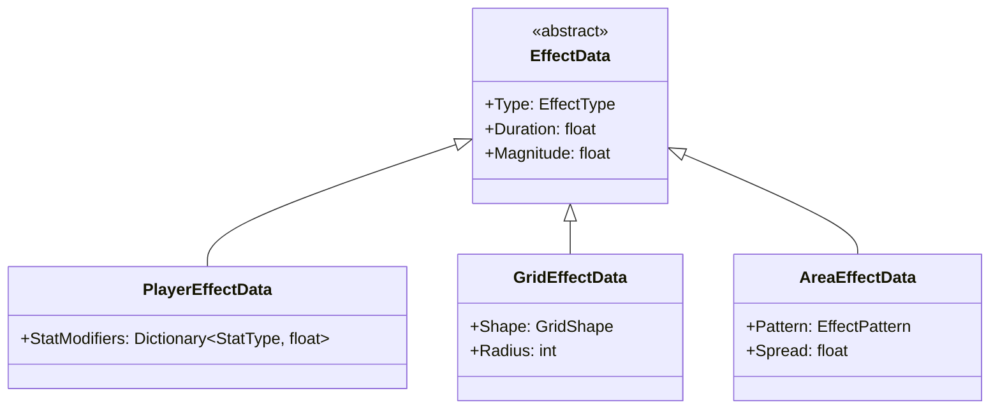
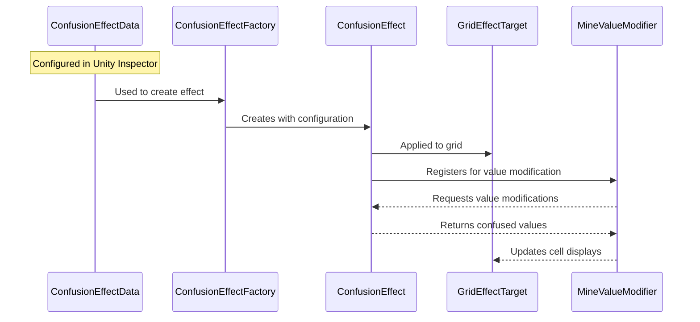
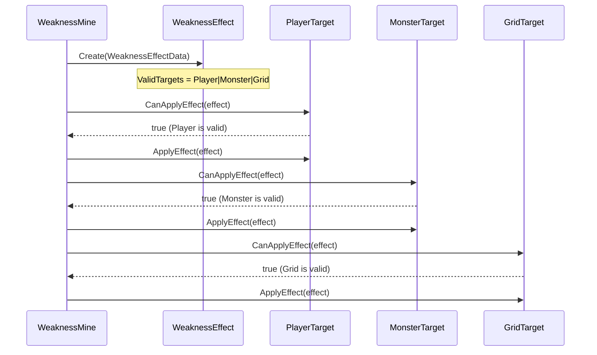

# Effect System Refactoring Analysis

## Summary
- The user initiated a conversation about refactoring their effect system in a game, expressing concerns about the complexity of using multiple scriptable objects for different target types.

- The assistant proposed a refactoring approach that included an effect factory pattern, target-specific components, and a flexible configuration system to handle multiple targets without duplicating scriptable objects.

- The user inquired about how the refactored system would manage different targets, specifically asking if they would need to create multiple scriptable objects for effects targeting different entities.

- The assistant clarified that a single scriptable object could manage multiple targets by defining valid targets and target-specific settings, allowing for flexible and maintainable code.

- The conversation concluded with the user seeking further clarification on implementing effects with this new approach, and the assistant provided detailed examples of how to handle target-specific behaviors without creating redundant scriptable objects.


## Current System Analysis

### Structure


### Current Issues
1. **Tight Coupling**: The `EffectData` ScriptableObject directly creates effect instances, leading to tight coupling between configuration and implementation.
2. **Limited Flexibility**: The switch statement in `CreateEffect()` makes it difficult to add new effect types without modifying existing code.
3. **Mixed Concerns**: Effect configuration (ScriptableObject) and behavior (IEffect implementation) are tightly intertwined.
4. **Target Type Handling**: The current system doesn't elegantly handle different target types, relying on a simple enum.

## Proposed Solution

### 1. Effect Factory Pattern


### 2. Target-Specific Effect Components


### 3. Effect Configuration System


## Implementation Plan

### Phase 1: Effect Factory System
1. Create `IEffectFactory` interface
2. Implement `EffectRegistry` for factory management
3. Create concrete factories for each effect type
4. Update `EffectData` to use factory system

```csharp
public interface IEffectFactory
{
    IEffect CreateEffect(EffectData data);
}

public class EffectRegistry : MonoBehaviour
{
    private Dictionary<EffectType, IEffectFactory> m_Factories = new();
    
    public void RegisterFactory(EffectType type, IEffectFactory factory)
    {
        m_Factories[type] = factory;
    }
    
    public IEffect CreateEffect(EffectData data)
    {
        if (m_Factories.TryGetValue(data.Type, out var factory))
        {
            return factory.CreateEffect(data);
        }
        return null;
    }
}
```

### Phase 2: Target System
1. Define `IEffectTarget` interface
2. Create target-specific implementations
3. Update effect application logic

```csharp
public interface IEffectTarget
{
    bool CanApplyEffect(EffectType type);
    void ApplyEffect(IEffect effect);
    void RemoveEffect(IEffect effect);
}

public class PlayerEffectTarget : MonoBehaviour, IEffectTarget
{
    private PlayerStats m_Stats;
    
    public bool CanApplyEffect(EffectType type)
    {
        return type == EffectType.Heal || type == EffectType.Shield;
    }
    
    public void ApplyEffect(IEffect effect)
    {
        // Handle player-specific effects
    }
}
```

### Phase 3: Configuration System
1. Create specialized effect data classes
2. Update ScriptableObject creation
3. Implement configuration validation

```csharp
[CreateAssetMenu(menuName = "RPGMinesweeper/Effects/PlayerEffect")]
public class PlayerEffectData : EffectData
{
    public Dictionary<StatType, float> StatModifiers = new();
    
    public override bool Validate()
    {
        return StatModifiers.Count > 0;
    }
}
```

## Benefits

1. **Decoupled Design**: Effect creation is separated from configuration
2. **Extensibility**: New effects can be added without modifying existing code
3. **Type Safety**: Target-specific implementations provide better type safety
4. **Maintainability**: Clear separation of concerns between configuration and behavior
5. **Flexibility**: Easy to add new target types and effect patterns

## Migration Strategy

1. Create new factory system alongside existing code
2. Gradually migrate effects to new system
3. Update effect targets to implement new interface
4. Replace old configuration system
5. Remove deprecated code

## Usage Example

```csharp
// Creating an effect
[SerializeField] private PlayerEffectData m_HealEffectData;
[SerializeField] private EffectRegistry m_EffectRegistry;

private void ApplyHeal(GameObject target)
{
    var effect = m_EffectRegistry.CreateEffect(m_HealEffectData);
    var effectTarget = target.GetComponent<IEffectTarget>();
    
    if (effectTarget != null && effectTarget.CanApplyEffect(effect.Type))
    {
        effectTarget.ApplyEffect(effect);
    }
}
```

## Next Steps

1. Implement base factory system
2. Create first target-specific implementation
3. Update effect configuration assets
4. Test with simple effect type
5. Gradually migrate existing effects

# Confusion Effect Example

## Configuration

```csharp
// ScriptableObject for configuring confusion effect
[CreateAssetMenu(menuName = "RPGMinesweeper/Effects/GridEffect")]
public class ConfusionEffectData : GridEffectData
{
    [Header("Confusion Settings")]
    public float TickInterval = 1f;
    public string ConfusionSymbol = "?";
    public Color ConfusionColor = Color.magenta;
}
```

## Factory Implementation

```csharp
public class ConfusionEffectFactory : IEffectFactory
{
    public IEffect CreateEffect(EffectData data)
    {
        if (data is ConfusionEffectData confusionData)
        {
            return new ConfusionEffect(
                confusionData.Duration,
                confusionData.Shape,
                confusionData.Radius,
                confusionData.TickInterval,
                confusionData.ConfusionSymbol,
                confusionData.ConfusionColor
            );
        }
        return null;
    }
}
```

## Effect Implementation

```csharp
public class ConfusionEffect : IPassiveEffect
{
    private readonly float m_Duration;
    private readonly GridShape m_Shape;
    private readonly int m_Radius;
    private readonly float m_TickInterval;
    private readonly string m_Symbol;
    private readonly Color m_Color;
    private readonly HashSet<Vector2Int> m_AffectedCells = new();
    private float m_ElapsedTime;

    public EffectType Type => EffectType.Confusion;
    public float Duration => m_Duration;

    public ConfusionEffect(float duration, GridShape shape, int radius, 
        float tickInterval, string symbol, Color color)
    {
        m_Duration = duration;
        m_Shape = shape;
        m_Radius = radius;
        m_TickInterval = tickInterval;
        m_Symbol = symbol;
        m_Color = color;
    }

    public void Apply(GameObject source, Vector2Int sourcePosition)
    {
        // Get affected positions based on shape and radius
        m_AffectedCells.Clear();
        m_AffectedCells.UnionWith(
            GridShapeHelper.GetAffectedPositions(sourcePosition, m_Shape, m_Radius)
        );

        // Register effect with value modifier
        foreach (var pos in m_AffectedCells)
        {
            MineValueModifier.RegisterEffect(pos, this);
        }
    }

    public void Remove(GameObject source, Vector2Int sourcePosition)
    {
        // Unregister effect from value modifier
        foreach (var pos in m_AffectedCells)
        {
            MineValueModifier.UnregisterEffect(pos, this);
        }
        m_AffectedCells.Clear();
    }

    public void OnTick(GameObject source, Vector2Int sourcePosition)
    {
        m_ElapsedTime += Time.deltaTime;
        if (m_ElapsedTime >= Duration)
        {
            Remove(source, sourcePosition);
        }
    }

    // Called by MineValueModifier when modifying cell values
    public (int value, Color color) ModifyValue(int originalValue)
    {
        return (-1, m_Color); // -1 represents confusion symbol
    }
}
```

## Target Implementation

```csharp
public class GridEffectTarget : MonoBehaviour, IEffectTarget
{
    private GridManager m_GridManager;

    public bool CanApplyEffect(EffectType type)
    {
        return type == EffectType.Confusion;
    }

    public void ApplyEffect(IEffect effect)
    {
        if (effect is ConfusionEffect confusionEffect)
        {
            confusionEffect.Apply(gameObject, transform.position);
            
            // Force grid to update affected cells
            m_GridManager.UpdateAffectedCells(
                confusionEffect.GetAffectedPositions()
            );
        }
    }

    public void RemoveEffect(IEffect effect)
    {
        if (effect is ConfusionEffect confusionEffect)
        {
            confusionEffect.Remove(gameObject, transform.position);
            
            // Force grid to update previously affected cells
            m_GridManager.UpdateAffectedCells(
                confusionEffect.GetAffectedPositions()
            );
        }
    }
}
```

## Usage Flow

1. **Configuration**:
   ```csharp
   // In Unity Inspector
   [SerializeField] private ConfusionEffectData m_ConfusionData;
   [SerializeField] private EffectRegistry m_EffectRegistry;
   ```

2. **Registration**:
   ```csharp
   void Awake()
   {
       // Register confusion effect factory
       m_EffectRegistry.RegisterFactory(
           EffectType.Confusion, 
           new ConfusionEffectFactory()
       );
   }
   ```

3. **Application**:
   ```csharp
   void ApplyConfusionEffect(Vector2Int position)
   {
       // Create effect instance
       var effect = m_EffectRegistry.CreateEffect(m_ConfusionData);
       
       // Find grid target
       var grid = FindObjectOfType<GridEffectTarget>();
       
       // Apply if valid
       if (grid != null && grid.CanApplyEffect(effect.Type))
       {
           grid.ApplyEffect(effect);
       }
   }
   ```

## Key Benefits

1. **Separation of Concerns**:
   - Configuration (ConfusionEffectData)
   - Creation (ConfusionEffectFactory)
   - Behavior (ConfusionEffect)
   - Target handling (GridEffectTarget)

2. **Flexibility**:
   - Easy to modify confusion parameters via ScriptableObject
   - Can change affected area shape without changing effect logic
   - Can add new confusion variations by extending GridEffectData

3. **Maintainability**:
   - Each component has a single responsibility
   - No switch statements or type checking
   - Clear flow of data and control

4. **Extensibility**:
   - New effect types can be added without modifying existing code
   - Can add new target types by implementing IEffectTarget
   - Factory system allows for complex effect creation logic

## Data Flow Diagram



# Multi-Target Effect System

## Target Type Implementation

```csharp
[Flags]
public enum EffectTargetType
{
    None = 0,
    Player = 1 << 0,
    Monster = 1 << 1,
    Grid = 1 << 2,
    Area = 1 << 3
}

public interface IEffectTarget
{
    EffectTargetType TargetType { get; }
    bool CanApplyEffect(IEffect effect);
    void ApplyEffect(IEffect effect);
    void RemoveEffect(IEffect effect);
}
```

## Effect Data with Target Constraints

```csharp
public abstract class EffectData : ScriptableObject
{
    [Header("Target Settings")]
    [SerializeField] private EffectTargetType m_ValidTargets;
    public EffectTargetType ValidTargets => m_ValidTargets;
}

// Example 1: Single-target effect
[CreateAssetMenu(menuName = "RPGMinesweeper/Effects/PoisonEffect")]
public class PoisonEffectData : PlayerEffectData
{
    public PoisonEffectData()
    {
        // Can only affect players
        ValidTargets = EffectTargetType.Player;
    }
}

// Example 2: Multi-target effect
[CreateAssetMenu(menuName = "RPGMinesweeper/Effects/WeaknessEffect")]
public class WeaknessEffectData : EffectData
{
    public WeaknessEffectData()
    {
        // Can affect players, monsters, and grid
        ValidTargets = EffectTargetType.Player | 
                      EffectTargetType.Monster | 
                      EffectTargetType.Grid;
    }
}
```

## Mine Implementation with Effects

```csharp
// Example 1: Simple mine with single-target effect
public class PoisonMine : MonoBehaviour
{
    [SerializeField] private PoisonEffectData m_PoisonData;
    private EffectRegistry m_Registry;

    public void OnTrigger(GameObject target)
    {
        var effect = m_Registry.CreateEffect(m_PoisonData);
        var effectTarget = target.GetComponent<IEffectTarget>();
        
        // Only applies to players
        if (effectTarget != null && effectTarget.CanApplyEffect(effect))
        {
            effectTarget.ApplyEffect(effect);
        }
    }
}

// Example 2: Complex mine with multi-target effect
public class WeaknessMine : MonoBehaviour
{
    [SerializeField] private WeaknessEffectData m_WeaknessData;
    private EffectRegistry m_Registry;

    public void OnTrigger(Vector2Int position)
    {
        var effect = m_Registry.CreateEffect(m_WeaknessData);
        
        // Get all potential targets in range
        var targets = GetTargetsInRange(position);
        
        // Apply to all valid targets
        foreach (var target in targets)
        {
            var effectTarget = target.GetComponent<IEffectTarget>();
            if (effectTarget != null && effectTarget.CanApplyEffect(effect))
            {
                effectTarget.ApplyEffect(effect);
            }
        }
    }
}
```

## Target Implementation Examples

```csharp
// Example 1: Player target
public class PlayerEffectTarget : MonoBehaviour, IEffectTarget
{
    public EffectTargetType TargetType => EffectTargetType.Player;
    
    public bool CanApplyEffect(IEffect effect)
    {
        // Check if this target type is included in effect's valid targets
        return (effect.ValidTargets & TargetType) != 0;
    }
    
    public void ApplyEffect(IEffect effect)
    {
        // Handle player-specific effect application
        if (effect is PoisonEffect poisonEffect)
        {
            // Apply poison to player
        }
        else if (effect is WeaknessEffect weaknessEffect)
        {
            // Apply weakness to player
        }
    }
}

// Example 2: Monster target
public class MonsterEffectTarget : MonoBehaviour, IEffectTarget
{
    public EffectTargetType TargetType => EffectTargetType.Monster;
    
    public bool CanApplyEffect(IEffect effect)
    {
        return (effect.ValidTargets & TargetType) != 0;
    }
    
    public void ApplyEffect(IEffect effect)
    {
        // Handle monster-specific effect application
        if (effect is WeaknessEffect weaknessEffect)
        {
            // Apply weakness to monster
        }
    }
}
```

## Key Points

1. **Target Type Definition**:
   - Uses flags enum to allow multiple valid targets
   - Each target type is a power of 2 for bitwise operations
   - Easy to combine multiple target types using the | operator

2. **Effect Configuration**:
   - Effects define their valid targets in the ScriptableObject
   - Configuration is done once at the data level
   - Clear visual feedback in Unity Inspector

3. **Target Validation**:
   - Each target implements `IEffectTarget`
   - `CanApplyEffect` checks if the target type is valid for the effect
   - Bitwise operations for efficient target type checking

4. **Effect Application**:
   - Mines can apply effects to single or multiple targets
   - Target components handle their specific effect implementations
   - Clean separation between effect data, targets, and application logic

## Example Flow



# Flexible Effect Targeting

## Single ScriptableObject, Multiple Targets

```csharp
[CreateAssetMenu(menuName = "RPGMinesweeper/Effects/PoisonEffect")]
public class PoisonEffectData : EffectData
{
    [Header("Effect Settings")]
    public float DamagePerTick = 5f;
    public float TickInterval = 1f;
    
    [Header("Target Settings")]
    [Tooltip("Select all valid targets for this poison effect")]
    [SerializeField] private EffectTargetType m_ValidTargets = 
        EffectTargetType.Player | 
        EffectTargetType.Monster; // Default to both
    
    [Header("Target-Specific Settings")]
    [Tooltip("Damage multiplier for each target type")]
    public SerializableDictionary<EffectTargetType, float> DamageMultipliers = new()
    {
        { EffectTargetType.Player, 1.0f },
        { EffectTargetType.Monster, 0.8f }
    };
}
```

## Effect Implementation with Target-Specific Logic

```csharp
public class PoisonEffect : IPassiveEffect
{
    private readonly PoisonEffectData m_Data;
    private readonly EffectTargetType m_CurrentTarget;
    
    public PoisonEffect(PoisonEffectData data, EffectTargetType targetType)
    {
        m_Data = data;
        m_CurrentTarget = targetType;
    }
    
    public void OnTick(GameObject target)
    {
        float baseDamage = m_Data.DamagePerTick;
        float multiplier = m_Data.DamageMultipliers.GetValueOrDefault(m_CurrentTarget, 1f);
        float finalDamage = baseDamage * multiplier;
        
        // Apply damage based on target type
        switch (m_CurrentTarget)
        {
            case EffectTargetType.Player:
                var player = target.GetComponent<PlayerStats>();
                player?.TakeDamage(finalDamage);
                break;
                
            case EffectTargetType.Monster:
                var monster = target.GetComponent<MonsterStats>();
                monster?.TakeDamage(finalDamage);
                break;
        }
    }
}
```

## Factory with Target Awareness

```csharp
public class PoisonEffectFactory : IEffectFactory
{
    public IEffect CreateEffect(EffectData data, EffectTargetType targetType)
    {
        if (data is PoisonEffectData poisonData)
        {
            return new PoisonEffect(poisonData, targetType);
        }
        return null;
    }
}
```

## Usage Example

```csharp
// In your mine or ability class
[SerializeField] private PoisonEffectData m_PoisonData;

public void ApplyPoison(GameObject target)
{
    var effectTarget = target.GetComponent<IEffectTarget>();
    if (effectTarget == null) return;
    
    // Create effect specifically for this target type
    var effect = m_Registry.CreateEffect(
        m_PoisonData, 
        effectTarget.TargetType
    );
    
    if (effectTarget.CanApplyEffect(effect))
    {
        effectTarget.ApplyEffect(effect);
    }
}
```

## Benefits

1. **Single Configuration**: 
   - One ScriptableObject for the effect
   - Configure all target-specific variations in one place
   - Easy to manage and modify

2. **Target-Specific Behavior**:
   - Different damage values per target type
   - Custom implementation per target
   - Flexible multipliers and modifiers

3. **Runtime Adaptation**:
   - Effect behavior adapts to the target
   - No need for separate effect instances
   - Clean and maintainable code

## Unity Inspector View
```
PoisonEffect (ScriptableObject)
├── Effect Settings
│   ├── DamagePerTick: 5
│   └── TickInterval: 1
├── Target Settings
│   └── Valid Targets: Player, Monster
└── Target-Specific Settings
    ├── Player Multiplier: 1.0
    └── Monster Multiplier: 0.8
```

This approach gives you:
1. One ScriptableObject to manage
2. Different behaviors per target
3. Easy configuration in Unity Inspector
4. Clean, maintainable code
5. Flexible runtime behavior
