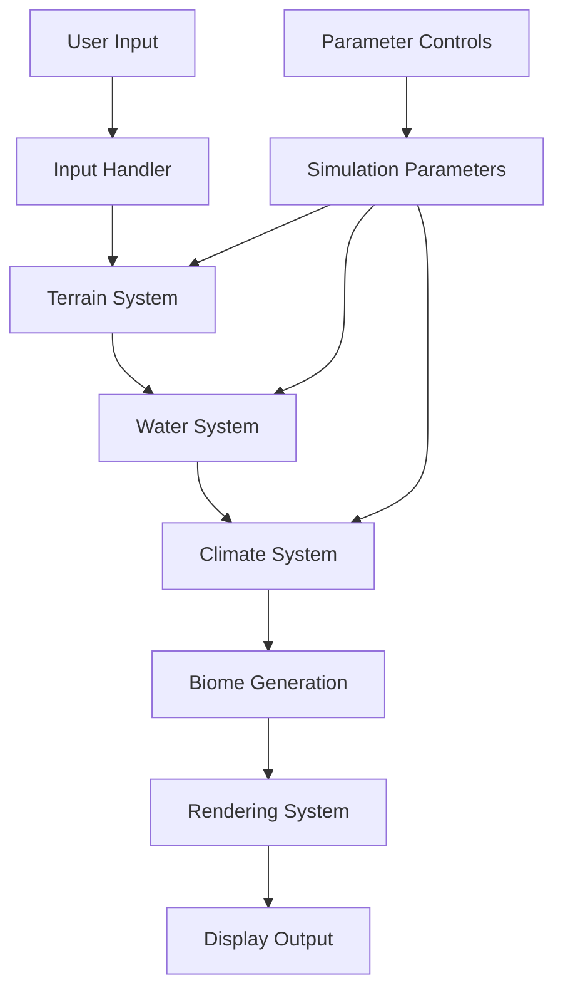

# MapGen4 Analysis & Unity Implementation Strategy

## Overview
MapGen4 is an interactive map generation system that combines user input with procedural generation to create realistic fantasy-style maps. This analysis breaks down the system for reimplementation in Unity.

## Core Systems Architecture

### 1. Data Structure Layer
- **Mesh Generation System**
  - Voronoi/Delaunay triangulation for base terrain
  - Vertex/triangle data structures
  - Height map representation
  
- **Map Data Container**
  - Elevation data
  - Moisture levels
  - Temperature values
  - Biome classifications
  - River network structure

### 2. Simulation Layer
- **Terrain System**
  - Elevation calculation
  - Distance field computation
  - Mountain/valley formation
  
- **Water System**
  - Ocean simulation
  - River generation
  - Rainfall patterns
  - Moisture distribution
  
- **Climate System**
  - Wind simulation
  - Temperature calculation
  - Biome determination
  - Weather patterns

### 3. Interaction Layer
- **Input Handler**
  - Terrain painting tools
  - Parameter adjustments
  - Camera controls
  
- **Feedback System**
  - Real-time preview
  - Parameter validation
  - Visual feedback

### 4. Rendering Layer
- **Terrain Visualization**
  - Custom shader system
  - Biome coloring
  - Height-based rendering
  
- **Style System**
  - Outline generation
  - Hand-drawn effect
  - Custom projection handling

## Data Flow

